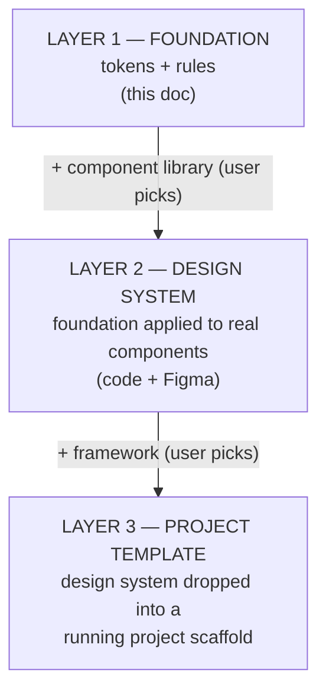
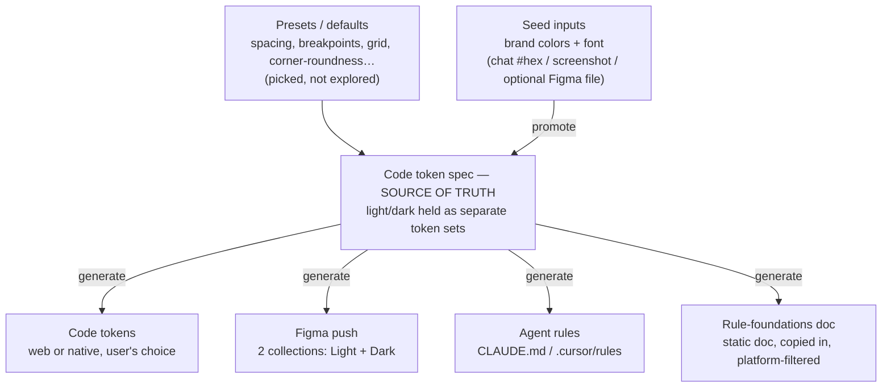
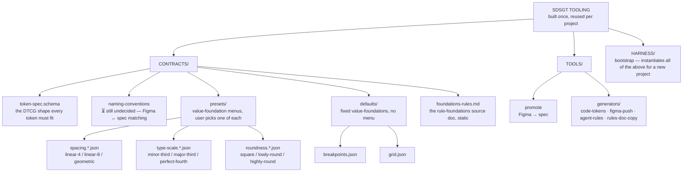
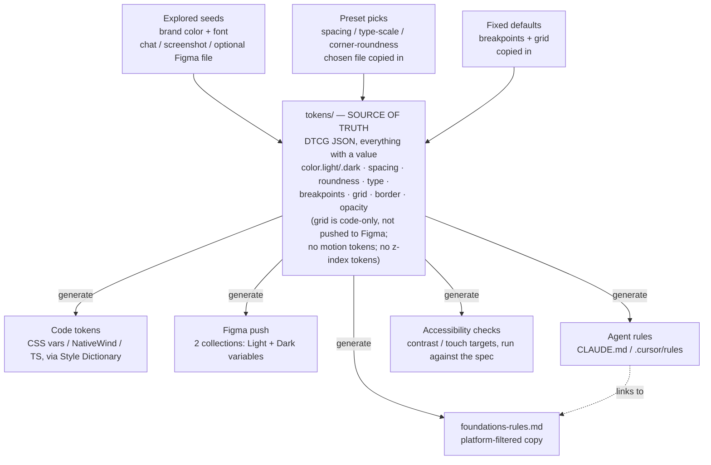

# SDSGT Pipeline Plan (working)

Status: planning — no code generated yet. Rewritten in plain language 2026-08-15 (originally written 2026-08-11 under Opus; see `docs/archive/pipeline-plan-archive.md` for the original wording, kept verbatim for reference).

This is the working plan for the design-system-generation slice of SDSGT — the process, and the decisions settled so far.

---

## Three layers

The design system (this doc) is step one of three. Each layer builds on the one before it, adding one more user choice:

Each layer is a one-way add-on, and code stays the source of truth throughout — the design system stays framework-agnostic so Layer 3 is a drop-in, not a merge.

**Layer 3 (the scaffold itself) is optional.** Someone who already has an existing project doesn't want a brand-new repo — they want the design-system output files (tokens, agent rules, maybe styled components) to drop in. So the tool asks up front whether to produce a full new-project scaffold, or just the design-system files on their own. Either way, a target framework/platform still has to be picked (see "How generation actually works" below), since code-token output shape depends on it regardless of whether a scaffold gets built — the scaffold question only decides whether the official scaffolding CLI (`create-next-app` etc.) also gets run.

**Layer 2 is where the real difficulty is**, not Layer 1 or 3:
- Applying tokens to a component library means mapping our tokens onto that library's own theming setup (its expected variable names, its assumptions) — and every library does this differently, so "let the user pick a library" multiplies the work.
- The lessons from the ACIM app apply directly here: trim vendored components to only what's used, mark customized files clearly, never blindly re-run a vendor's install command, and watch for `tailwind-merge` not overriding cleanly.
- The Figma side of components is much more fragile than the Figma side of tokens. Tokens-as-variables is simple and proven; a full component library in Figma (variants, auto-layout, binding) is visual and finicky — expect a build-screenshot-check-adjust loop, not a clean one-shot.

**Tokens and components round-trip differently — this is a deliberate, accepted asymmetry:**
- **Tokens** round-trip cleanly and automatically: edit in Figma → pull into code → done. (See "Editing model" below — this works because of how Figma variables can *link* to each other.)
- **Components do not.** Code is the source of truth for a component's structure; Figma only ever shows a generated picture of it. If someone rearranges a component visually in Figma, that change does not flow back into code by itself — there's no reliable way to read "you rearranged this layout" back out of Figma. Getting a Figma-side component change into code is a manual, on-demand thing (ask an agent to go look and re-create it in code), not an automatic stage of the pipeline.

---

## Tool architecture: CLI core, thin per-agent adapters

Everything above describes what SDSGT produces. This section is about SDSGT itself — what form the generator takes, and how it gets run.

**The decision: build a standalone CLI (a real, runnable command-line program) that holds 100% of the pipeline logic, and make every AI assistant a thin wrapper around it — not the other way around.** Concretely: color math, DTCG token emission, Style Dictionary conversion, driving the official scaffolding CLIs, writing agent-rules files, and token-sync all live in actual code behind a command (e.g. `sdsgt generate --config project.json`). Claude Code, Codex, and Cursor each just get a short instruction telling them to run that command — none of them contain their own copy of the pipeline logic.

This replaces the earlier assumption that the generator would simply "run as a Claude Code skill." That assumption was made for expedience early on (it matched how development itself was happening) and was never checked against alternatives. It doesn't hold up for two reasons that matter here:

- **It would lock the tool to Claude Code.** If the real logic is written as instructions inside a skill file, Codex and Cursor can't read or run it — they'd need their own separate reimplementation.
- **It gives a future GUI nothing to call.** A GUI front-end can trivially spawn a CLI as a child process; it can't "call" a skill embedded in another tool's instruction format. Building the logic as a CLI from the start avoids a rewrite later.

**Why a CLI is *more* deterministic than a skill, not less.** A skill is plain-English instructions an AI interprets fresh each time it runs — even a capable AI can vary subtly run to run (a rounding choice, a skipped sub-step). A CLI is real code: same input, same output, every single time. Moving logic out of the skill and into the CLI is a predictability upgrade.

**The adapters:**

| Platform | How it points at the CLI |
|---|---|
| **Claude Code** | The `/SDSGT-start` skill — gathers input via conversation, writes/runs a config, interprets the result. This is today's dev interface, and it stays, but only as a wrapper. |
| **Codex** | An `AGENTS.md` entry in the SDSGT repo itself, documenting the CLI command. Codex reads `AGENTS.md` natively and can shell out to it. |
| **Cursor** | A `.cursor/rules` entry doing the same, since Cursor doesn't read `AGENTS.md` natively but does run terminal commands. |
| **MCP server** | Deferred, not built first. More setup friction for a non-developer user than "run a command," and SDSGT is mostly a linear wizard rather than a set of granular tools an agent picks between — the case MCP is strongest for. Revisit if a real need shows up. |
| **Future GUI** | Spawns the CLI directly as a child process. No AI assistant required for the parts of the pipeline that don't need one. |

**Mid-pipeline questions still work.** The CLI can stop and ask something partway through — that's normal for command-line tools. In practice this happens one of two ways: the AI assistant holds the whole conversation with the user up front and hands the CLI a completed config to run straight through, or the CLI runs in stages and hands a question back to the AI to relay to the user, who answers, and that answer feeds the next stage. Either way, the user only ever talks to the AI — never to a raw terminal prompt.

**Not everything belongs in the CLI — some steps genuinely need an AI.** Splitting the pipeline this way keeps the architecture honest:
- **Deterministic (belongs in the CLI core):** color-formula math, DTCG emission, Style Dictionary conversion, copying preset files, writing agent-rules/`foundations-rules.md`/`design.md`, driving the scaffolding CLIs, accessibility/contrast checks, token-sync diffing.
- **Genuinely needs an AI (stays in the adapter/agent layer):** interpreting a screenshot into brand colors, the conversational input-gathering itself, and the fragile Figma *component* build-screenshot-check-adjust loop (Layer 2).
- **Ambiguous, and currently assumed to stay agent-side: the Figma token push.** Figma's official REST API for writing variables has historically required an Enterprise plan — likely why both Figma MCP options (official and Southleft) work through the Figma app itself rather than that API. If that's still accurate, the CLI genuinely can't do the Figma push alone for most users, and it has to stay MCP-mediated (agent-dependent) rather than a pure CLI operation. This needs to be confirmed — see "Pre-launch validation" below. Either way, the Figma push stays an **optional module**, never a hard dependency: the CLI core can generate a complete, working design system with zero Figma involvement.

**On the "free plan needs Southleft MCP, paid plan needs official MCP" question — these are two separate things, not one.** Your own test in `docs/figma-mcp-capabilities.md` already shows the Southleft MCP hitting the same "1 mode per collection" wall on a free-plan file. That's strong evidence the mode restriction comes from **the Figma account's plan tier**, not from which MCP tool is used — neither MCP can make Figma allow more modes than the account pays for. The real (still untested) difference between the two MCP options is *how you connect* — Southleft requires the Figma Desktop app open with a bridge plugin running; how the official MCP connects hasn't been verified yet. That's the actual open question, not a free/paid split.

**Distribution and naming.** Publishing the CLI publicly (e.g. to npm) is optional, not required for the AI-agent flow to work — since an AI assistant runs the command rather than a human typing it, each adapter can fetch/install the tool directly without ever relying on a human typing an install command correctly. If it does get published publicly later (e.g. so a developer can also run it by hand), standard package-registry risks apply — most notably typosquatting (malicious lookalike package names), a known problem across npm/PyPI generally, not unique to this tool. Mitigations if/when that happens: publish under a scoped name (e.g. `@sdsgt/cli`) rather than a bare word, defensively register obvious name variants, use npm's provenance attestation to tie the package to a specific verified build, and always point users to one trusted install command from official docs rather than letting them search/guess.

---

## How generation actually works

A user supplies a few raw creative decisions, the tool turns those into a full structured system, and from then on, code is the master copy.

**1. Seed input** — the user supplies the raw creative decisions: brand colors (a hue is extracted, the rest gets derived) and a base font, plus the preset picks (spacing, corner-roundness, etc). These can arrive as raw `#hex` values in chat, a screenshot, or an optional Figma file — Figma is one possible channel, never required. This is also where two output-shape questions get asked, since they affect what "generate" produces later: **which target framework/platform** (Next.js, Vue.js, React Native, Kotlin, etc. — needed regardless of scaffolding, since it decides the code-token output shape) and **scaffold a full new project, or just hand back the design-system files** to drop into an existing one (see "Three layers" above).

**2. Promote** — the seeds get turned into a real structured token system: **primitives** (computed once, then locked in as plain values) and **semantics** (real links back to those primitives). The moment this happens, code becomes the source of truth. (See "Formulas run once" below for why this matters.)

**3. Generate** — from that spec, the tool produces code tokens and agent rules, plus asks the user one more question before it can finish the Figma side: **manage tokens via Figma, or via code only?** (Figma remains fully optional here too — this isn't a re-ask of the seed-input channel, it's a separate choice about the ongoing token-management interface.) If the user opts into Figma, the tool asks for a connection to a Figma file (via the official Figma MCP, or the Southleft MCP — see "Still open" below for which is primary) and detects whether that file is on a free or paid Figma plan, since the plan determines how light/dark gets structured in the push (see "Light/dark mode" below). Figma at this point is a generated result, not a scratchpad anymore.

The pipeline asks for input at several points along the way, not all upfront in one form — seed inputs, preset picks, the status-color choice, and this Figma-management question all happen at the point they're actually needed.

### Pretokens (the raw seeds)

Pretokens are the *optional* Figma-based way to supply seeds — not the only way. The same brand-color-and-font seeds can just as easily be typed as `#hex` values in chat or shown as a screenshot. Use an actual Figma pretokens file only when someone wants to see color/font choices visually before deciding; skip it entirely when the values are already known.

What they are: unstructured swatches and samples on a Figma canvas — a rectangle filled with a candidate brand color, a text sample in a candidate font. Only brand colors and fonts get explored this way — corner-roundness moved to the preset-menu path instead (see "Value-foundations" below), since it's a small, opinionated choice rather than something worth free-form exploring.

Generating from pretokens means going from a couple of raw picks to an entire system — not copying them 1:1. From one brand color, the tool derives tints/shades, hover/active/disabled states, semantic roles (background/foreground/border), and light + dark versions. From a font + base size, it derives a full type scale with roles (heading/body/caption). The generated system is a sensible default, not a final answer — the user prunes what isn't needed before it becomes canonical (in keeping with "don't build things just in case").

This needs a naming convention so the tool knows what it's reading — e.g., a dedicated "Pretokens" area in the Figma file where a swatch's name carries meaning (`brand/primary`, `font/base`). That naming convention is still undecided — see "Naming & structure conventions" below.

Once pretokens are promoted into real tokens, the pretoken scratch area is spent — it's not touched again. Ongoing editing happens in the generated Figma projection instead (see next section). The rule that prevents confusion: **a token is only ever edited in one place at a time.**

### Editing model: what can be changed in Figma and synced back

Think of tokens like a spreadsheet. A cell can hold **a value you typed** (`#3B82F6`), or **a formula** ("brand color, 20% darker"). Figma only ever shows the final result of a cell — it doesn't remember formulas.

So every token is one of three things:

| Kind | Plain example | Can you edit it in Figma and sync it back to code? |
|---|---|---|
| **A value you picked** | "Brand blue is `#3B82F6`" | Yes, no issues |
| **A link to another token** | "Button color = *same as* brand blue" | Yes — Figma understands links between variables |
| **An auto-calculated value** | "This shade = brand blue, 20% darker" | The only tricky case |

The first two cover the large majority of real design work, and sync cleanly both ways. The one gotcha: if a token is auto-calculated and someone hand-edits the result directly in Figma, the next recalculation could silently overwrite that edit. Two ways around it: **change the ingredient the formula uses** (always safe), or **don't auto-calculate that token at all** — hand-pick the value instead, which turns it into "a value you picked" and the gotcha disappears entirely. The one thing that's genuinely not possible from Figma: inventing a brand-new calculation rule — that's a one-time code change, not a design action.

If someone overrides a linked token with a raw color in Figma (breaking the link, on purpose or by accident), the tool can't guess their intent — so it flags it during the next sync ("this token is no longer linked — keep it as a fixed value?") instead of silently deciding for them.

### Formulas run once, then get locked in

This is what makes the "auto-calculated" gotcha above basically go away. **A formula runs exactly once, at the moment seeds get promoted into tokens — and the result is saved as a plain value from then on.** Same idea as using a spreadsheet formula to fill in a column, then doing "paste as values" and deleting the formula. After that point, nothing in the live system is still auto-calculating:

- **Primitives are locked-in (baked) values.** For example, the main brand color is one primitive; a 20%-lighter tint is a second primitive, computed once at promotion time and then stored as a plain color from then on. Fully editable in Figma afterward, with no formula left to fight with.
- **Semantics are real links to primitives**, also fully editable (re-point which primitive they link to). Editing a primitive automatically flows through to anything linked to it.

The trade-off, accepted on purpose: because formulas only run once, re-generating a whole palette after changing the main brand color is a deliberate, separate action — a "regenerate this palette" step you choose to run, which will replace any manual shade edits made since the last time it ran. Day to day, everything is freely editable; regenerating is an intentional reset, not something that happens quietly in the background.

**The color formula itself (brand color → full palette) is still just a starting proposal, not finalized:** the idea is to work in HSL (hue/saturation/lightness), treat hue as the fixed anchor, and build the palette by adjusting saturation and lightness from there. The exact steps, how many, and whether hue ever shifts are still to be decided later. Whatever formula is finally chosen, results still get baked into plain values per the rule above.

**Status colors (error/success/warning/info) and neutral grays can't just come from the brand hue** — an error message needs to unambiguously read as "error," not as "brand color, but sadder." So generation will ask the user to choose between:
- **Boilerplate (default)** — a conventional, safe, accessibility-sane status palette and a plain gray ramp.
- **Brand-derived** — the same colors, nudged toward the brand's hue while staying clearly recognizable as their intended meaning.

Either way, results get baked into plain values like everything else. The exact "nudge toward brand" formula is still to be worked out alongside the main color formula.

---

## Foundational settings: values vs. rules

Beyond colors and type, a design system needs things like a grid, breakpoints, accessibility minimums, and interactive states. These split into two genuinely different categories.

### Value-foundations — these are just more tokens

Breakpoints, grid (columns/gutter/margins/max-widths), spacing scale, corner-roundness, border widths, opacity. These all have an actual value that needs to stay consistent across web and native, so they live in the same token spec as everything else and flow through the same pipeline (code tokens + Figma push). There's no separate document for these — a second home would just mean a second source of truth to keep in sync.

A few scope notes:
- **Motion (durations, easing) isn't generated at all.** It's too specific to the platform/framework/component library in use.
- **Z-index/elevation isn't generated either**, for the same reason — it belongs to whichever component library gets used, not to the foundation.
- **Grid stays a code-only token — it's not pushed to Figma as a variable.** In Figma, a grid is a property of a frame (a "layout grid style"), not a variable, so it doesn't fit the same push mechanism. Breakpoints push fine, since they're just plain numbers.

These don't go through the explore-and-promote loop the way brand color does — nobody hand-draws a breakpoint in Figma. Instead, each one gets its starting value one of three ways, and once it's in the spec, it's an ordinary editable token like anything else:

| How it starts | Examples | Decided by |
|---|---|---|
| **Explored per project** | brand colors, font | The user, via chat / screenshot / optional Figma file |
| **Picked from a preset menu** | spacing rhythm, corner-roundness, type-scale ratio | The user, choosing from 2-3 options at generation time |
| **Fixed default** | breakpoints, grid | Shipped as-is, no choice needed |

The preset menus themselves ship as real token files (e.g. a `lowly-round` roundness file, a `linear-8` spacing file) — generation literally copies the chosen file into the project's token spec, so it's transparent and editable afterward, not a hidden config flag. The menus stay small and opinionated on purpose (2-3 good options, not an open-ended configurator) — the goal is a sane default in seconds, not infinite customization up front.

**Corner-roundness specifically** ships as a preset menu — **square / lowly-round / highly-round** — the same mechanism as spacing and type scale, rather than a freely-explored pretoken like color. A fourth option, **squircle** (the smoothed, flowing corner shape used on iOS app icons), is deliberately deferred rather than included now — it's not just a bigger radius value, it needs real platform-specific drawing work (SVG/clip-path on web, custom masking on native) that doesn't exist yet. See "Deferred," below.

### Rule-foundations — a static reference doc, not something generated

Accessibility contrast minimums, minimum touch-target sizes (44px on iOS, 48dp on Android), the requirement for a visible focus state, respecting a user's reduced-motion setting, what interactive states a component needs, and general token-usage do's and don'ts. These aren't values to pick — they're near-universal rules about *how* tokens and components should be used, and they don't really change project to project.

Because they're universal, they're not generated — they're a static document the tool ships and copies into every project unchanged (aside from filtering by platform — e.g. only including the iOS touch-target rule for a native project).

This content lives in exactly one place, with everything else pointing to it rather than repeating it:

| Where | What's there |
|---|---|
| **The canonical doc** (`foundations-rules.md`, ships with every project) | The full, human-readable explanation — this is the source of truth |
| **Agent rules** (`CLAUDE.md` / `.cursor/rules` / `AGENTS.md`) | Not the full explanation — just a short pointer to the doc, plus the handful of hard always/never rules an agent needs on hand while working |
| **Automated checks** | Whichever of these rules can actually be checked by a machine (e.g. contrast ratios) get run as validation against the token spec |

**Automated contrast checking needs one more piece to work:** to check contrast, the tool needs to know which text color is meant to sit on which background color — the token spec alone doesn't say that. The plan is to have the token *naming convention* carry that information (e.g. a token named `text-on-primary` implies it's meant to sit on `primary`), which is nearly free once the naming convention exists (see "Naming & structure conventions" below). If that doesn't end up working, contrast falls back to being a written guideline rather than an automated check.

Accessibility checks run once, at the moment seeds get promoted into tokens. If someone hand-edits tokens after that, they're doing so at their own risk of breaking one of these rules — promotion is the checkpoint, not a background process constantly watching for problems.

### design.md — a second doc, separate from foundations-rules.md, and it IS generated

`foundations-rules.md` is universal and static (same content, every project). **`design.md` is the opposite: project-specific and generated**, since it needs to reference the actual tokens, roles, and components a given project ended up with — not generic advice. Think "here's how to actually use *this* project's design system" (e.g. which semantic token names exist, which component variants were kept after pruning, how roundness/spacing presets were resolved) rather than universal accessibility rules. It's populated at Generate time from the same token spec everything else comes from.

So a generated project's agent-facing docs are two static-vs-generated pairs, not one:

| Doc | Scope | Generated or static |
|---|---|---|
| `foundations-rules.md` | Universal rules (a11y, touch targets, focus, do's/don'ts) | Static — copied in unchanged, platform-filtered |
| `design.md` | This project's actual tokens/components and how to use them | Generated — built from this project's token spec |

Agent rule files point to **both**, not just one.

### Agent rule files: platform-agnostic canonical content, thin per-platform pointers

No coding agent today reads a single universal instructions file out of the box — `CLAUDE.md` is Claude Code-specific, `.cursor/rules` is Cursor-specific, and so on. The closest thing to a real cross-tool convention is **`AGENTS.md`** (an open format originally pushed by OpenAI for Codex, since gaining broader recognition) — so the plan is to make `AGENTS.md` the canonical pointer file, and have every other platform's rule file be a thin wrapper around it rather than duplicated content:

- **`AGENTS.md`** — the canonical file: pointers to `foundations-rules.md` and `design.md`, plus the sharpest always/never rules. Read natively by Codex.
- **`CLAUDE.md`** — as short as possible, using Claude Code's `@path` import syntax to pull in `AGENTS.md` directly rather than re-stating it.
- **`.cursor/rules`** — Cursor doesn't read `AGENTS.md` natively, so this stays its own file (frontmatter-based `.mdc`), but its content is still just a pointer to the same two docs, kept in sync with `AGENTS.md` rather than diverging.

So a generated project's full agent-rules set is: `AGENTS.md` (canonical) + `CLAUDE.md` (imports it) + `.cursor/rules` (mirrors it) + the two docs they all point to (`foundations-rules.md`, `design.md`).

---

## Everything settled so far, in one list

- **The tool starts in Claude Code, not Figma.** Figma is an output, never the master copy.
- **Tokens are stored in the W3C "DTCG" JSON format** — a standard format (not hand-rolled), readable by agents, and already spoken by Figma's own token tooling, which is what makes the Figma round-trip work cleanly.
- **Style Dictionary is the tool that converts those tokens into real platform code** (CSS, TypeScript, etc.) — this is a firm choice, not one of several options left open.
- **Figma "styles" (not just variables) are usable as tokens too.** Figma variables only hold color/number/string/boolean, so things like shadows and fonts live as Figma *styles* instead — but those are just as readable and writable via the Figma MCP, confirmed working for both effect styles (shadows) and text styles (fonts). See `docs/figma-mcp-capabilities.md`. A shadow token's pieces (blur, spread, offset, color) map onto primitive variables that get composed into a Figma effect style.
- **The tool is platform-agnostic at the token level.** The spec itself doesn't know or care what platform it's for — the user picks a target framework, and the generator emits the right shape. Initially conceived as web (CSS variables/Tailwind theme) vs. React Native (TypeScript/NativeWind constants), but the intended scaffold list is broader: **Next.js, Vue.js, React Native, Kotlin (native Android), native iOS (SwiftUI), etc.** Kotlin and native iOS are each a meaningfully bigger lift than adding "one more CLI to drive" — they're true native, not JS-based, so each needs its own code-token output shape (not a variant of the CSS/TS work), not just a new `create-*-app` command. See "Still open" below.
- **Light/dark mode structure branches on the connected Figma file's plan, detected at connection time.** Figma's free tier only allows one "mode" per variable collection, so on a **free plan**, the tool creates two separately-named collections (`Tokens / Light` and `Tokens / Dark`) with identical variable names — no values are lost, it's just not a one-click toggle inside Figma the way a paid plan's "modes" feature would allow. On a **paid plan**, the tool instead pushes one collection with light and dark as two *modes* of the same collection, which is the more native Figma experience. Code-side, this distinction doesn't matter: light and dark are just two separate token sets either way, and Style Dictionary emits both regardless of which Figma structure was used. (Detecting the plan reliably still needs to be tested — see "Pre-launch validation" below.)
- **Editing model = the layer-split described above.** Values you typed, and links between tokens, are freely editable in Figma and sync back cleanly. Auto-calculated results are edited through their inputs instead, or get "frozen" into an explicit override if someone edits the output directly.
- **Formulas run once, then get locked into plain values** (see above) — this is what makes the editing model above actually work in practice, since there's no live formula left to silently overwrite someone's edit.
- **Foundational settings split into value-foundations (just more tokens) and rule-foundations (a static shipped doc)** — see above for the full reasoning. Motion and z-index/elevation are excluded entirely (too platform/library-specific); grid is code-only and doesn't push to Figma.
- **The generator's logic lives in a CLI core; every AI assistant is a thin adapter over it, not a container for the logic itself.** The Claude Code skill (working name `/SDSGT-start`) is today's dev interface — the user runs it, it asks for the seed inputs, platform/framework, and preset choices, then runs the seed → promote → generate pipeline — but it's a wrapper around the CLI, not the tool itself. Not a clone-and-hand-edit repo. See "Tool architecture" above for the full reasoning (cross-agent support, determinism, and future-GUI readiness).
- **Scaffolding a new project is optional, output-files-only is a first-class outcome, not a fallback.** At seed input, the tool asks (a) target framework/platform — always, since it decides the code-token output shape regardless of the next answer — and (b) whether to also run a full project scaffold or just hand back the design-system files for dropping into an existing project. See "Three layers" above.
- **Every seed input is multi-channel, and Figma is optional on both ends.** Brand colors and font can arrive as `#hex` in chat, a screenshot, or an optional Figma file — no Figma file is ever required to generate a design system. Symmetrically, editing tokens through Figma afterward is also optional — someone can just edit the code tokens directly instead.
- **There are two different Figma-to-code operations, and they're not interchangeable:**
  1. **Promote-from-seeds** — the structural one. Reads the pretokens and (re)builds the entire token system from scratch. This is destructive (replaces the whole spec) — it's what happens the first time, or as a deliberate "throw away my earlier decisions and start over" reset. It is not part of routine day-to-day use.
  2. **Token sync** — the everyday one. Edits an existing value or link, syncs just that change back to code. Non-destructive, incremental, and this is the one piece that stays live inside a generated project after it's handed off.
- **After a project is generated, it keeps only the token-sync engine — not the full generator.** From that point on, the intended way to change the design system is to edit token values/links directly (in Figma or code) and sync — not to re-run the full promote step, which would be the explicit "start over" path, chosen knowingly rather than accidentally.
- **Token-sync staying live is not the same commitment as keeping agent-rules files in sync.** The Figma ↔ code *token* sync is a real, ongoing SDSGT responsibility (that's the whole point of the sync engine). Agent-rules-file drift (someone's `CLAUDE.md` growing project-specific notes that never make it into `AGENTS.md`) is explicitly **not** SDSGT's responsibility once a project is handed off — same boundary as "a generated project never receives retroactive updates," just applied to rules files instead of tokens. If someone switches tools months later, migrating that drift is on them (or a five-minute one-off task for whatever agent they switch to), not something SDSGT ships tooling for.
- **Because of that boundary, the pushed Figma DS file must never contain agent-rules content — tokens/styles only.** Keeping the Figma file strictly to variables and styles (no agent-instruction data) is what lets the token-sync engine stay scoped to *just* tokens indefinitely, without ever needing to know about — or touch — `AGENTS.md`/`CLAUDE.md`/`.cursor/rules` or their drift. This is a generation-time constraint, not just a naming convention: the Figma push generator should have no code path that writes agent-rules content into the Figma file at all.
- **A generated project never receives retroactive updates from the tool.** If the SDSGT generator improves later, that improvement doesn't flow into projects that were already generated — each one is frozen at the moment it was scaffolded. This matches the tool's actual purpose (hand someone a solid starting point, then it's theirs) and mirrors the same lesson from the ACIM app (vendored components don't get silently re-synced from upstream either).
- **Corner-roundness ships as a small preset menu** (square / lowly-round / highly-round), the same mechanism as spacing rhythm and type scale — chosen at generation time, not explored per-project like color. Squircle is a deferred addition (see "Deferred," below) since it needs real platform-specific drawing work, not just a bigger number.
- **Agent rules use `AGENTS.md` as the platform-agnostic canonical file**, since no coding agent reads a truly universal instructions file today and `AGENTS.md` is the closest thing to a real cross-tool convention. `CLAUDE.md` imports it (via `@path` syntax) rather than duplicating it; `.cursor/rules` mirrors it since Cursor doesn't read `AGENTS.md` natively. See "Agent rule files" above.
- **A generated project's agent-facing docs are two separate files, not one:** `foundations-rules.md` (static, universal a11y/token rules, same every project) and `design.md` (generated, project-specific — this project's actual tokens/components and how to use them). Agent rule files point to both. See "design.md" above.

---

## What actually needs to get built

**1. Contracts** (build in parallel with Step 1 / seed input, not as a separate phase before it — see note below)
- **Token spec** — the actual DTCG JSON shape for colors, type scale, spacing, corner-roundness, and how light/dark token sets are structured.
- **Naming & structure conventions** — the token-naming rules and the Figma naming/collection rules, so promoting and pushing always agree on what maps to what. Covers the value-foundation groups too (spacing, breakpoints, grid, corner-roundness), not just color/type. **Still undecided — see "Naming & structure conventions" below.**
- **Preset library** — the actual token files for each value-foundation menu (spacing / type-scale / corner-roundness), plus the one fixed-default set for breakpoints/grid.
- **Rule-foundations doc** — the static `foundations-rules.md` itself (accessibility, touch targets, focus, states, do's/don'ts).
- **Agent rules template** — the fixed `AGENTS.md` skeleton every generated project's `AGENTS.md` is populated from: pointers to `foundations-rules.md` and `design.md`, plus the fixed always/never rules (e.g. use semantic tokens, not primitives, for color and typography). `CLAUDE.md` and `.cursor/rules` stay thin mirrors of it, per "Agent rule files" above — not separate contracts of their own.

> **Build-order note:** Contracts are technically seeds too — just predetermined ones (fixed by the tool's design) rather than user-inputted ones (like brand color or font). So instead of treating "Contracts" as a strict phase that must fully finish before Step 1 (seed input) can be touched, build them in parallel: flesh out seed input and the naming/token-spec conventions together, since seed input is the first thing that actually needs those conventions to exist. Test the pair together before moving on to Step 2 (promote).

**2. Tools**
- **Promote** — reads Figma variables, writes them into the token spec.
- **Generators** — turn the spec into code tokens (via Style Dictionary), a Figma push, agent rules (`AGENTS.md` canonical + `CLAUDE.md` + `.cursor/rules`), a platform-filtered copy of `foundations-rules.md`, and a generated `design.md` (this project's actual tokens/components — see "design.md" above). The Figma push is intended to work from a **hand-designed template file** (see "Pre-launch validation" below) rather than building the file's structure from raw API/MCP calls each run — the tool duplicates the template into the user's Figma account, then populates it with the generated token values. Not yet confirmed feasible.
- **Foundations sheet generator** — a visual reference sheet inside Figma. Deliberately built later, since it's the fragile, iterate-by-screenshot part — variables come first, the visual sheet comes second.

**3. Harness** (what turns this from a one-off into a reusable tool)
- **CLI core** — the standalone, config-driven command-line program that holds the pipeline logic (see "Tool architecture" above). Everything in "Tools" above should be written as real code behind this, not as instructions inside an agent's skill file.
- **Per-agent adapters** — the thin wrappers that point each AI assistant at the CLI: the Claude Code skill, an `AGENTS.md` entry for Codex, a `.cursor/rules` entry for Cursor.
- **Bootstrap/scaffold** — the piece that instantiates everything above for a brand-new app or website.

---

## Where things live

Two separate homes: the **SDSGT tooling itself** (built once, holds the inputs and generators), and **a generated project** (produced fresh each time someone runs it).

**SDSGT tooling** (built once, reused per project):

**Generated project** (one per run):

A couple of things worth noticing in these diagrams:
- **Value-foundations never get their own file type — they're tokens the whole way through.** The only thing that differs between them is how they get their starting value (explored, preset, or default, per the table above). Once they're in `tokens/`, corner-roundness is handled exactly the same way as brand color downstream.
- **Rule-foundations skip the token spec entirely**, since they have no values to store. They travel through the pipeline only as a file copy (filtered by platform) from the tooling's `foundations-rules.md` into the project's own copy.
- **Agent rules are a pointer, not a copy.** They contain a link to the rules doc plus only the sharpest always/never instructions — the full explanation lives in exactly one place.

---

## Still open

- **Which component library/libraries to support first** — not chosen yet.
- **Which scaffold frameworks/platforms to support, and in what order** — the intended list includes Next.js, Vue.js, React Native, Kotlin (native Android), and native iOS (SwiftUI), but nothing's prioritized yet. Kotlin and native iOS each need their own code-token output work (real native, not a JS/CSS variant), so they're likely later additions rather than launch-day ones. Native iOS was added for parity with Kotlin (native Android) — until now the target list covered Android natively but iOS only indirectly, through React Native, not through true SwiftUI.
- **Working pace for this project** — step-by-step confirmation (as with the ACIM app) vs. faster batched changes. (Current default: see "Working style" in `CLAUDE.md` — step-by-step, confirm before big changes.)
- **When the design system extends into actual components** — this is where Layer 2 begins (see "Three layers" above). Deliberately not started until it's actually needed.
- **What exactly the skill produces underneath** — a plain generated folder, or something more structured (an installable package, etc.) — and how the retained token-sync engine gets packaged into a generated project.
- **Which Figma MCP is primary** — the official Figma MCP, or the Southleft MCP — for the Figma connection step during Generate. This is a connection-mechanism question, not a free/paid-plan question (see "Tool architecture" above) — Southleft's known caveat is that it requires the Figma Desktop app open with a bridge plugin running; how the official MCP connects is untested. Whether the tool supports both and lets the user pick, or standardizes on one, isn't decided yet.
- **CLI package name, and whether/when to publish it publicly** — e.g. `sdsgt` vs. a scoped name like `@sdsgt/cli`. Not urgent, since AI-assistant adapters can install the tool directly without a human ever typing an install command — but worth deciding before any public release (see "Distribution and naming" under "Tool architecture" above).

## Pre-launch validation (must test before going public)

Two things this plan currently assumes work, that haven't actually been verified against a real Figma connection yet:

- **The official Figma MCP connection** — confirm it actually connects to a user's Figma file and can read/write variables end to end, the way `docs/figma-mcp-capabilities.md` currently documents for the Southleft MCP.
- **Free vs. paid plan detection** — confirm the tool can actually tell, from a connected Figma file, whether the workspace is on a free or paid plan. This is load-bearing: it decides whether light/dark gets pushed as two collections or two modes (see "Light/dark mode" above), so if detection turns out to be unreliable or impossible, that branching logic needs a fallback (e.g. just ask the user directly).
- **Template-based Figma generation** — test whether a design-system Figma file, hand-designed once and downloaded/saved as a template, can be used as the tool's starting point for every generation run: duplicate the template into the user's connected Figma account via MCP, then populate it with that project's actual token values. The goal is a **deterministic, consistent result every run**, instead of the tool building the file's structure freeform each time (which risks a different or lower-quality layout per generation). If this doesn't turn out to be technically workable via MCP, the fallback is building the structure from scratch each run, as originally planned.
- **Agents driving the CLI's non-interactive/config-driven mode** — confirm that Claude Code, Codex, and Cursor can each reliably write a config and run the CLI straight through (or handle staged runs cleanly), rather than getting stuck on live terminal prompts. This validates the whole cross-agent premise behind "Tool architecture" above.
- **Whether Figma's variable-write API is actually Enterprise-gated** — confirms whether the Figma push can ever be a pure CLI operation, or must always stay MCP/agent-mediated (see "Tool architecture" above). Directly affects how self-contained the CLI core can be.

None of these block ongoing design work, but all five must be resolved before the tool ships publicly.

## Deferred — noted on purpose, not forgotten

- **Fonts, icons, logos as actual files** (not just a token naming a font family) — a real asset-delivery pipeline is out of scope for now, to be designed when it's actually needed.
- **The contrast-check pairing input** — resolving exactly how the naming convention encodes "this text color sits on this background" (see "Rule-foundations" above), alongside the naming-convention work generally.
- **The actual color formulas** — both the brand-color-to-palette formula and the "nudge status colors toward the brand" formula (see "Formulas run once" above) are still just starting proposals.
- **Squircle as a corner-roundness option** — needs real per-platform drawing work (SVG/clip-path on web, custom masking on native) that doesn't exist yet. Revisit once the basic preset-menu roundness is working.
- **Layer 2 (component library) and Layer 3 (framework scaffold)** — the outer two layers. Layer 2 carries most of the real difficulty (see "Three layers" above); tackle after Layer 1 is solid.

## Naming & structure conventions

Both "promote" and "push" depend on one shared contract that doesn't exist yet: the actual token names, plus the Figma collection/naming rules (including the "Pretokens" area convention and the two-collection light/dark setup) — the thing that lets the tool reliably match a Figma variable back to its token. Several already-settled decisions assume this exists (semantic links, the baked-formula matching, reading pretokens at all).

This was **deliberately deferred**, not an oversight — other decisions were intentionally settled first. It's still undesigned, but it's no longer treated as a standalone gate that has to fully close before any building starts (see the build-order note under "What actually needs to get built"): it gets designed alongside Step 1 (seed input), since both are needed at the same point in the build.

## Next step

Start step-by-step build-and-test: flesh out Step 1 (seed input) together with the Contracts it depends on (token spec + naming & structure conventions), test that pair, then move to Step 2 (promote) and test it against Step 1, and so on — integrating each new step with what's already been tested rather than building all steps in isolation first. Keep resolving what's listed under "Still open" as it becomes relevant to whichever step is current.
