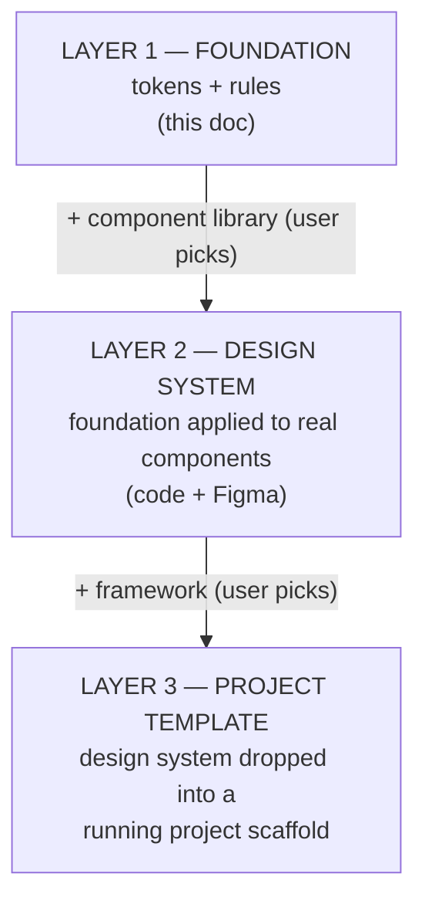
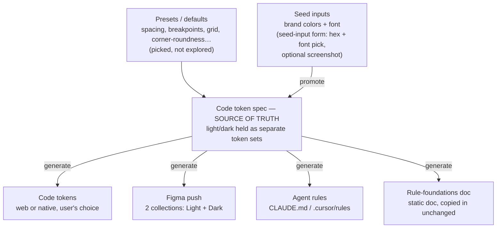
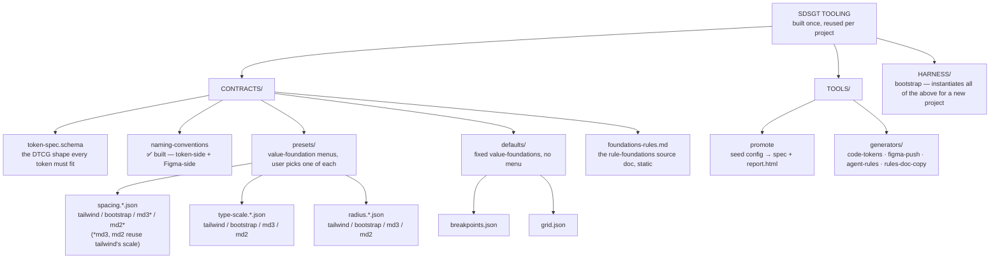
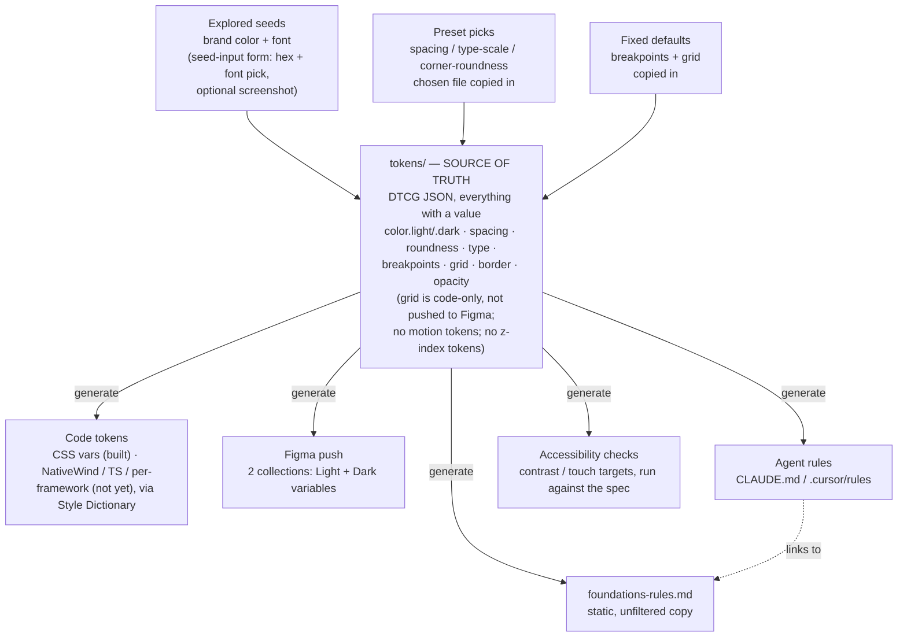

# SDSGT Pipeline Plan (working)

Status: planning — no code generated yet. Rewritten in plain language 2026-08-15 (originally written 2026-08-11 under Opus; see `docs/archive/pipeline-plan-archive.md` for the original wording, kept verbatim for reference).

This is the working plan for the design-system-generation slice of SDSGT — the process, and the decisions settled so far.

---

## Three layers

The design system (this doc) is step one of three. Each layer builds on the one before it, adding one more user choice:

Each layer is a one-way add-on, and code stays the source of truth throughout — the design system stays framework-agnostic so Layer 3 is a drop-in, not a merge.

**Layer 3 (the scaffold itself) is optional.** Someone who already has an existing project doesn't want a brand-new repo — they want the design-system output files (tokens, agent rules, maybe styled components) to drop in. So the tool asks up front whether to produce a full new-project scaffold, or just the design-system files on their own. Either way, a target framework/platform still has to be picked (see "How generation actually works" below), since code-token output shape depends on it regardless of whether a scaffold gets built — the scaffold question only decides whether the official scaffolding CLI (`create-next-app` etc.) also gets run.

**Layer 2 is where the real difficulty is**, not Layer 1 or 3:
- Applying tokens to a component library means mapping our tokens onto that library's own theming setup (its expected variable names, its assumptions) — and every library does this differently, so "let the user pick a library" multiplies the work.
- The lessons from the ACIM app apply directly here: trim vendored components to only what's used, mark customized files clearly, never blindly re-run a vendor's install command, and watch for `tailwind-merge` not overriding cleanly.
- The Figma side of components is much more fragile than the Figma side of tokens. Tokens-as-variables is simple and proven; a full component library in Figma (variants, auto-layout, binding) is visual and finicky — expect a build-screenshot-check-adjust loop, not a clean one-shot.

**Tokens and components round-trip differently — this is a deliberate, accepted asymmetry:**
- **Tokens** round-trip cleanly and automatically: edit in Figma → pull into code → done. (See "Editing model" below — this works because of how Figma variables can *link* to each other.)
- **Components do not.** Code is the source of truth for a component's structure; Figma only ever shows a generated picture of it. If someone rearranges a component visually in Figma, that change does not flow back into code by itself — there's no reliable way to read "you rearranged this layout" back out of Figma. Getting a Figma-side component change into code is a manual, on-demand thing (ask an agent to go look and re-create it in code), not an automatic stage of the pipeline.

---

## Tool architecture: CLI core, thin per-agent adapters

Everything above describes what SDSGT produces. This section is about SDSGT itself — what form the generator takes, and how it gets run.

**The decision: build a standalone CLI (a real, runnable command-line program) that holds 100% of the pipeline logic, and make every AI assistant a thin wrapper around it — not the other way around.** Concretely: color math, DTCG token emission, Style Dictionary conversion, driving the official scaffolding CLIs, writing agent-rules files, and token-sync all live in actual code behind a command (e.g. `sdsgt generate --config project.json`). Claude Code, Codex, and Cursor each just get a short instruction telling them to run that command — none of them contain their own copy of the pipeline logic.

This replaces the earlier assumption that the generator would simply "run as a Claude Code skill." That assumption was made for expedience early on (it matched how development itself was happening) and was never checked against alternatives. It doesn't hold up for two reasons that matter here:

- **It would lock the tool to Claude Code.** If the real logic is written as instructions inside a skill file, Codex and Cursor can't read or run it — they'd need their own separate reimplementation.
- **It gives a future GUI nothing to call.** A GUI front-end can trivially spawn a CLI as a child process; it can't "call" a skill embedded in another tool's instruction format. Building the logic as a CLI from the start avoids a rewrite later.

**Why a CLI is *more* deterministic than a skill, not less.** A skill is plain-English instructions an AI interprets fresh each time it runs — even a capable AI can vary subtly run to run (a rounding choice, a skipped sub-step). A CLI is real code: same input, same output, every single time. Moving logic out of the skill and into the CLI is a predictability upgrade.

**The adapters:**

| Platform | How it points at the CLI |
|---|---|
| **Claude Code** | The `/SDSGT-start` skill — gathers input via conversation, writes/runs a config, interprets the result. This is today's dev interface, and it stays, but only as a wrapper. |
| **Codex** | An `AGENTS.md` entry in the SDSGT repo itself, documenting the CLI command. Codex reads `AGENTS.md` natively and can shell out to it. |
| **Cursor** | A `.cursor/rules` entry doing the same, since Cursor doesn't read `AGENTS.md` natively but does run terminal commands. |
| **MCP server** | Deferred, not built first. More setup friction for a non-developer user than "run a command," and SDSGT is mostly a linear wizard rather than a set of granular tools an agent picks between — the case MCP is strongest for. Revisit if a real need shows up. |
| **Future GUI** | Spawns the CLI directly as a child process. No AI assistant required for the parts of the pipeline that don't need one. |

**Mid-pipeline questions still work.** The CLI can stop and ask something partway through — that's normal for command-line tools. In practice this happens one of two ways: the AI assistant holds the whole conversation with the user up front and hands the CLI a completed config to run straight through, or the CLI runs in stages and hands a question back to the AI to relay to the user, who answers, and that answer feeds the next stage. Either way, the user only ever talks to the AI — never to a raw terminal prompt.

**Not everything belongs in the CLI — some steps genuinely need an AI, or just need the network.** Splitting the pipeline this way keeps the architecture honest:
- **Deterministic (belongs in the CLI core):** color-formula math, DTCG emission, Style Dictionary conversion, copying preset files, writing agent-rules/`foundations-rules.md`/`design.md`, driving the scaffolding CLIs, accessibility/contrast checks, token-sync diffing, `report.html` generation.
- **Genuinely needs an AI (stays in the adapter/agent layer):** interpreting a screenshot into brand colors, the conversational input-gathering itself, and the fragile Figma *component* build-screenshot-check-adjust loop (Layer 2).
- **Needs the network, not AI judgment (also stays in the adapter/agent layer):** fetching real font files for `report.html` (Google Fonts, via the skill — see "Fetching fonts" in `SKILL.md`). `promote` accepts the result through a `--fonts-dir` flag rather than fetching anything itself, same principle as the Figma push below — a CLI step that phones out to a third-party network service on every run isn't deterministic or offline-safe by definition, so it can't live in the CLI core no matter how mechanical the fetch itself is.
- **Decided: the Figma token push stays agent-side, split at the plan/replay line.** Figma's official REST API for writing variables has historically required an Enterprise plan — the Southleft MCP sidesteps that entirely by going through Figma's own Plugin API (the Desktop Bridge plugin) instead, which is what the built push actually depends on (see "Figma push" in `contracts-and-seeds.md`). Concretely: the CLI core computes a full, deterministic plan of what to create (`figma-plan.ts`, network-free, unit-testable); only *replaying* that plan into Figma needs an agent session with the MCP tool (`SDSGT-figma-push`). The Figma push stays an **optional module**, never a hard dependency: the CLI core generates a complete, working design system with zero Figma involvement either way.

**On the "free plan needs Southleft MCP, paid plan needs official MCP" question — these are two separate things, not one.** Your own test in `docs/figma-mcp-capabilities.md` already shows the Southleft MCP hitting the same "1 mode per collection" wall on a free-plan file. That's strong evidence the mode restriction comes from **the Figma account's plan tier**, not from which MCP tool is used — neither MCP can make Figma allow more modes than the account pays for. The real (still untested) difference between the two MCP options is *how you connect* — Southleft requires the Figma Desktop app open with a bridge plugin running; how the official MCP connects hasn't been verified yet. That's the actual open question, not a free/paid split.

**Distribution and naming.** Publishing the CLI publicly (e.g. to npm) is optional, not required for the AI-agent flow to work — since an AI assistant runs the command rather than a human typing it, each adapter can fetch/install the tool directly without ever relying on a human typing an install command correctly. If it does get published publicly later (e.g. so a developer can also run it by hand), standard package-registry risks apply — most notably typosquatting (malicious lookalike package names), a known problem across npm/PyPI generally, not unique to this tool. Mitigations if/when that happens: publish under a scoped name (e.g. `@sdsgt/cli`) rather than a bare word, defensively register obvious name variants, use npm's provenance attestation to tie the package to a specific verified build, and always point users to one trusted install command from official docs rather than letting them search/guess.

**Language and runtime — decided: Node.js + TypeScript, run directly, nothing published.** Chosen because Style Dictionary (already a firm choice, above) is itself a Node library, so the CLI core and the later token-conversion step share one runtime instead of shelling out between two languages; TypeScript also lets the DTCG token shapes from `contracts-and-seeds.md` be written as real types, so a token that doesn't match the contract fails to compile rather than silently drifting. The CLI runs its `.ts` files directly via Node's own built-in TypeScript support — no build step, no `ts-node`/`tsx` dependency needed for a plain run. `package.json` is marked `"private": true` (npm physically refuses to publish it) — this is a local-only dev tool, not a published package, per "Distribution and naming" above.

**Implementation notes for building against this (read before rebuilding the CLI from scratch):** a mix of Node-native-TypeScript sharp edges and real bugs hit while building `promote`/`report.html` against the token spec — worth knowing up front rather than re-discovering:
- **Relative imports between our own `.ts` files must use the literal `.ts` extension** (e.g. `import { x } from "./y.ts"`), not `.js`. Node's native TS runner does not remap `.js`→`.ts` the way bundler-oriented tools (`tsx`, `ts-node`, webpack) do — importing `"./y.js"` when only `y.ts` exists throws `ERR_MODULE_NOT_FOUND`.
- **Type-only imports need an explicit `type` marker** — either `import type { X } from "..."` on its own, or inline as `import { type X, y } from "..."`. Node's stripping only erases things it can already tell are type-only from the import statement itself; without the marker it tries to import `X` as a real value and throws a `SyntaxError` at runtime (not a type error — this fails even though nothing is "wrong" from TypeScript's point of view).
- **No TypeScript `enum`.** Enums compile down to real runtime code, which isn't something Node's type-stripping (an "erasable syntax" pass, not a compiler) can support — use a string-literal union type plus a plain object instead, which is what every type in this codebase already does.
- **`tsc --noEmit` (used only as a type-check, not to build anything) needs its own setup to match this style of code:** `@types/node` installed as a devDependency, plus `"allowImportingTsExtensions": true` and `"types": ["node"]` in `tsconfig.json`. Without these, `tsc` — which normally expects bundler-style extensionless imports — rejects the `.ts` extensions and the `node:`-prefixed built-ins as errors, even though the code runs fine.
- **Requires a reasonably current Node** — this was built and run on v25.9.0. Node's ability to run `.ts` files directly is a recent addition (landed behind a flag around the 22.x line, unflagged by default from roughly 23.6 onward); a syntax error the moment `node src/cli.ts` is invoked, on an older Node install, points at the Node version rather than a bug in the code.
- **A token's `$type` varies by design-language preset — never assume one shape covers every preset.** `shadow.*` is the concrete trap: `$type: "shadow"` (a real CSS layer array) for Tailwind/Bootstrap, but `$type: "dimension"` (a bare elevation number) for MD3/MD2 — see contracts-and-seeds.md, "Shadow." Code that reads `.$value` assuming the layer-object shape unconditionally (as `report.html`'s first version did) silently renders `undefined undefined undefined undefined undefined` for every MD3/MD2 project instead of erroring — only caught by actually running the MD3 example config, not by `tsc` (the field is typed `unknown` on purpose, since the shape is genuinely conditional). Branch on `$type`, and test against at least one Tailwind/Bootstrap config *and* one MD3/MD2 config before calling any new generator done.
- **`AskUserQuestion` (or any forced-choice prompt) requires at least 2 options — a single "Continue" button is invalid.** Came up writing the seed-input skill's disclosure steps (fixed defaults like border-width/breakpoints/grid, where there's nothing to actually choose): use a real second option (e.g. `Continue` / `Why isn't this a choice?`) instead of trying to force a single-option acknowledgment. See `SKILL.md`'s question table, rows 10/16/19/20.

---

## How generation actually works

A user supplies a few raw creative decisions, the tool turns those into a full structured system, and from then on, code is the master copy.

**1. Seed input** — the user supplies the raw creative decisions: brand colors (a hue is extracted, the rest gets derived) and a base font, plus the preset picks (spacing, corner-roundness, etc). These are gathered directly through the seed-input form — raw `#hex` values and a font pick — with an optional screenshot upload if someone wants the AI to read a value off an image first, rather than a dedicated Figma exploration step. This is also where two output-shape questions get asked, since they affect what "generate" produces later: **which target framework/platform** (Next.js, Vue.js, React Native, Kotlin, etc. — needed regardless of scaffolding, since it decides the code-token output shape) and **scaffold a full new project, or just hand back the design-system files** to drop into an existing one (see "Three layers" above).

**2. Promote** — the seeds get turned into a real structured token system: **primitives** (computed once, then locked in as plain values) and **semantics** (real links back to those primitives). The moment this happens, code becomes the source of truth. (See "Formulas run once" below for why this matters.)

**3. Generate** — from that spec, the tool produces code tokens and agent rules, plus asks the user one more question before it can finish the Figma side: **manage tokens via Figma, or via code only?** (Figma remains fully optional here too — this isn't a re-ask of the seed-input channel, it's a separate choice about the ongoing token-management interface.) If the user opts into Figma, the tool asks for a connection to a Figma file (via the official Figma MCP, or the Southleft MCP — see "Still open" below for which is primary) and detects whether that file is on a free or paid Figma plan, since the plan determines how light/dark gets structured in the push (see "Light/dark mode" below). Figma at this point is a generated result, not a scratchpad anymore.

The pipeline asks for input at several points along the way, not all upfront in one form — seed inputs, preset picks, the status-color choice, and this Figma-management question all happen at the point they're actually needed.

### Seed input (the raw brand colors + font)

Brand colors and font are gathered directly through the seed-input form — no separate Figma exploration step. Colors are entered as `#hex` values in chat, and fonts are picked from a list, with an optional screenshot upload if someone wants the AI to read a value off an image first rather than typing it directly. Only brand colors and fonts get gathered this way — corner-roundness moved to the preset-menu path instead (see "Value-foundations" below), since it's a small, opinionated choice rather than something worth free-form exploring.

This drops the old "Pretokens" idea — a dedicated Figma page with named layers (`brand/primary`, `font/base`) that "promote" had to parse. There's nothing to parse anymore: the form's fields are already unambiguous, so the naming-convention work this used to require (see "Naming & structure conventions" below) no longer applies to seed input at all.

Generating from these seed inputs means going from a couple of raw picks to an entire system — not copying them 1:1. From one brand color, the tool derives tints/shades, hover/active/disabled states, semantic roles (background/foreground/border), and light + dark versions. From a font + base size, it derives a full type scale with roles (heading/body/caption). The generated system is a sensible default, not a final answer — the user prunes what isn't needed before it becomes canonical (in keeping with "don't build things just in case").

Once the form's seed values are promoted into real tokens, they're simply primitives in the token spec from then on — there's no separate scratch area to retire. Ongoing editing happens in the generated Figma projection instead (see next section). The rule that prevents confusion: **a token is only ever edited in one place at a time.**

### Editing model: what can be changed in Figma and synced back

Think of tokens like a spreadsheet. A cell can hold **a value you typed** (`#3B82F6`), or **a formula** ("brand color, 20% darker"). Figma only ever shows the final result of a cell — it doesn't remember formulas.

So every token is one of three things:

| Kind | Plain example | Can you edit it in Figma and sync it back to code? |
|---|---|---|
| **A value you picked** | "Brand blue is `#3B82F6`" | Yes, no issues |
| **A link to another token** | "Button color = *same as* brand blue" | Yes — Figma understands links between variables |
| **An auto-calculated value** | "This shade = brand blue, 20% darker" | The only tricky case |

The first two cover the large majority of real design work, and sync cleanly both ways. The one gotcha: if a token is auto-calculated and someone hand-edits the result directly in Figma, the next recalculation could silently overwrite that edit. Two ways around it: **change the ingredient the formula uses** (always safe), or **don't auto-calculate that token at all** — hand-pick the value instead, which turns it into "a value you picked" and the gotcha disappears entirely. The one thing that's genuinely not possible from Figma: inventing a brand-new calculation rule — that's a one-time code change, not a design action.

If someone overrides a linked token with a raw color in Figma (breaking the link, on purpose or by accident), the tool can't guess their intent — so it flags it during the next sync ("this token is no longer linked — keep it as a fixed value?") instead of silently deciding for them.

### Formulas run once, then get locked in

This is what makes the "auto-calculated" gotcha above basically go away. **A formula runs exactly once, at the moment seeds get promoted into tokens — and the result is saved as a plain value from then on.** Same idea as using a spreadsheet formula to fill in a column, then doing "paste as values" and deleting the formula. After that point, nothing in the live system is still auto-calculating:

- **Primitives are locked-in (baked) values.** For example, the main brand color is one primitive; a 20%-lighter tint is a second primitive, computed once at promotion time and then stored as a plain color from then on. Fully editable in Figma afterward, with no formula left to fight with.
- **Semantics are real links to primitives**, also fully editable (re-point which primitive they link to). Editing a primitive automatically flows through to anything linked to it.

The trade-off, accepted on purpose: because formulas only run once, re-generating a whole palette after changing the main brand color is a deliberate, separate action — a "regenerate this palette" step you choose to run, which will replace any manual shade edits made since the last time it ran. Day to day, everything is freely editable; regenerating is an intentional reset, not something that happens quietly in the background.

**The color formula (brand color → full 11-step ramp) is decided:** work in HSL, hold hue and saturation fixed at the base color's own values, and interpolate lightness in 5 equal steps toward a fixed near-white target (lighter steps) and a fixed near-black target (darker steps). Same formula for `brand`, `brand-secondary`, and `neutral`. Exact numbers in `contracts-and-seeds.md`, "Color primitives." Results still get baked into plain values per the rule above.

**Status colors (error/success/warning/info/promo) can't just come from the brand hue** — an error message needs to unambiguously read as "error," not as "brand color, but sadder." So status colors always use **Boilerplate** — a conventional, safe, accessibility-sane status palette, fixed hue per role and independent of the brand color. **Decided** — exact formula in `contracts-and-seeds.md`, "Color primitives." Not a user choice — a **brand-derived** variant (the same colors nudged toward the brand's hue) was considered and dropped, not deferred; see `contracts-proposals.md` for the reasoning trail.

**Neutral grays are a separate seed choice, not tied to status-color style:** the user picks brand-tinted (a faint hint of the brand's hue) or pure achromatic gray for the `neutral` ramp's base color, then the same ramp-interpolation formula above generates the rest. See `contracts-and-seeds.md`, "Seed inputs" (Neutral colors) and "Color primitives."

Either way, results get baked into plain values like everything else.

---

## Foundational settings: values vs. rules

Beyond colors and type, a design system needs things like a grid, breakpoints, accessibility minimums, and interactive states. These split into two genuinely different categories.

### Value-foundations — these are just more tokens

Breakpoints, grid (columns/gutter/margins/max-widths), spacing scale, corner-roundness, border widths, opacity. These all have an actual value that needs to stay consistent across web and native, so they live in the same token spec as everything else and flow through the same pipeline (code tokens + Figma push). There's no separate document for these — a second home would just mean a second source of truth to keep in sync.

A few scope notes:
- **Motion (durations, easing) isn't generated at all.** It's too specific to the platform/framework/component library in use.
- **Z-index/elevation isn't generated either**, for the same reason — it belongs to whichever component library gets used, not to the foundation.
- **Grid stays a code-only token — it's not pushed to Figma as a variable.** In Figma, a grid is a property of a frame (a "layout grid style"), not a variable, so it doesn't fit the same push mechanism. Breakpoints push fine, since they're just plain numbers.

These don't go through the explore-and-promote loop the way brand color does — nobody hand-draws a breakpoint in Figma. Instead, each one gets its starting value one of three ways, and once it's in the spec, it's an ordinary editable token like anything else:

| How it starts | Examples | Decided by |
|---|---|---|
| **Explored per project** | brand colors, font | The user, via the seed-input form (hex + font pick, optional screenshot) |
| **Picked from a preset menu** | spacing rhythm, corner-roundness, type-scale ratio | The user, choosing from a 4-way menu (Tailwind / Bootstrap / Material Design 3 / Material Design 2) at generation time, recommended-matched to whichever target design language was already picked |
| **Fixed default** | breakpoints, grid | Shipped as-is, no choice needed |

The preset menus themselves ship as real token files (e.g. an `md3` roundness file, a `bootstrap` spacing file) — generation literally copies the chosen file into the project's token spec, so it's transparent and editable afterward, not a hidden config flag. The menus stay small and opinionated on purpose (four good options, not an open-ended configurator) — the goal is a sane default in seconds, not infinite customization up front.

**Corner-roundness specifically** ships as the same 4-way preset menu as spacing and type-scale — matched to the design-language pick (Tailwind / Bootstrap / Material Design 3 / Material Design 2), not a tool-original 3-way preset — rather than a freely-explored pretoken like color. See `contracts-and-seeds.md` for the exact role keys and values. A future option, **squircle** (the smoothed, flowing corner shape used on iOS app icons), is deliberately deferred rather than included now — it's not just a bigger radius value, it needs real platform-specific drawing work (SVG/clip-path on web, custom masking on native) that doesn't exist yet. See "Deferred," below.

### Rule-foundations — a static reference doc, not something generated

Accessibility contrast minimums, minimum touch-target sizes (44px on iOS, 48dp on Android), the requirement for a visible focus state, respecting a user's reduced-motion setting, what interactive states a component needs, and general token-usage do's and don'ts. These aren't values to pick — they're near-universal rules about *how* tokens and components should be used, and they don't really change project to project.

Because they're universal, they're not generated — they're a static document the tool ships and copies into every project unchanged (aside from filtering by platform — e.g. only including the iOS touch-target rule for a native project).

This content lives in exactly one place, with everything else pointing to it rather than repeating it:

| Where | What's there |
|---|---|
| **The canonical doc** (`foundations-rules.md`, ships with every project) | The full, human-readable explanation — this is the source of truth |
| **Agent rules** (`CLAUDE.md` / `.cursor/rules` / `AGENTS.md`) | Not the full explanation — just a short pointer to the doc, plus the handful of hard always/never rules an agent needs on hand while working |
| **Automated checks** | Whichever of these rules can actually be checked by a machine (e.g. contrast ratios) get run as validation against the token spec |

**Automated contrast checking needs one more piece to work:** to check contrast, the tool needs to know which text color is meant to sit on which background color — the token spec alone doesn't say that. The plan is to have the token *naming convention* carry that information (e.g. a token named `text-on-primary` implies it's meant to sit on `primary`), which is nearly free once the naming convention exists (see "Naming & structure conventions" below). If that doesn't end up working, contrast falls back to being a written guideline rather than an automated check.

Accessibility checks run once, at the moment seeds get promoted into tokens. If someone hand-edits tokens after that, they're doing so at their own risk of breaking one of these rules — promotion is the checkpoint, not a background process constantly watching for problems.

**Accessibility checks are advisory, not a gate.** Whatever Promote checks — contrast, or any future check on colors or other properties — gets *flagged*, never enforced. A failing check doesn't stop token generation, doesn't get silently auto-corrected, and doesn't imply the flagged pair is actually rendered together in the UI (checking two tokens against each other tests an assumption about how they're used, which isn't always true — e.g. a status role's saturated `.200` tone might be used as an icon or badge fill on a neutral surface, never actually stacked on its own `.100` tint). Flagged results surface in the console, in `report.html`, and — once `foundations-rules.md` exists in a generated project — there too, so a human or agent downstream can decide whether and how to address it. Decided after the boilerplate status-color formula moved to framework-sourced hex values (`contracts-and-seeds.md`, "Boilerplate status-color formula") and several roles turned out unable to hit `.100`/`.200` contrast no matter the tint chosen — warm hues like amber/orange structurally can't clear 3:1 against any pale tint of themselves.

### design.md — a second doc, separate from foundations-rules.md, and it IS generated

`foundations-rules.md` is universal and static (same content, every project). **`design.md` is the opposite: project-specific and generated**, since it needs to reference the actual tokens, roles, and components a given project ended up with — not generic advice. Think "here's how to actually use *this* project's design system" (e.g. which semantic token names exist, which component variants were kept after pruning, how roundness/spacing presets were resolved) rather than universal accessibility rules. It's populated at Generate time from the same token spec everything else comes from.

So a generated project's agent-facing docs are two static-vs-generated pairs, not one:

| Doc | Scope | Generated or static |
|---|---|---|
| `foundations-rules.md` | Universal rules (a11y, touch targets, focus, do's/don'ts) | Static — copied in unchanged, identical on every project (contracts-and-seeds.md decided against platform-filtering it — its content is reference material that reads fine regardless of target) |
| `design.md` | This project's actual tokens/components and how to use them | Generated — built from this project's token spec |

Agent rule files point to **both**, not just one.

**`design.md`'s own contract (its exact template/content shape) is not defined yet, and deliberately deferred** — see "Deferred," below. That its existence and purpose are worth committing to now, ahead of building it, is settled; what it actually contains is not, and isn't required for the pipeline to work. Flagged as a good addition for a more solid product later, not a blocker for v1.

### Agent rule files: platform-agnostic canonical content, thin per-platform pointers

No coding agent today reads a single universal instructions file out of the box — `CLAUDE.md` is Claude Code-specific, `.cursor/rules` is Cursor-specific, and so on. The closest thing to a real cross-tool convention is **`AGENTS.md`** (an open format originally pushed by OpenAI for Codex, since gaining broader recognition) — so the plan is to make `AGENTS.md` the canonical pointer file, and have every other platform's rule file be a thin wrapper around it rather than duplicated content:

- **`AGENTS.md`** — the canonical file: pointers to `foundations-rules.md` and `design.md`, plus the sharpest always/never rules. Read natively by Codex.
- **`CLAUDE.md`** — as short as possible, using Claude Code's `@path` import syntax to pull in `AGENTS.md` directly rather than re-stating it.
- **`.cursor/rules`** — Cursor doesn't read `AGENTS.md` natively, so this stays its own file (frontmatter-based `.mdc`), but its content is still just a pointer to the same two docs, kept in sync with `AGENTS.md` rather than diverging.

So a generated project's full agent-rules set is: `AGENTS.md` (canonical) + `CLAUDE.md` (imports it) + `.cursor/rules` (mirrors it) + the two docs they all point to (`foundations-rules.md`, `design.md`).

---

## Everything settled so far, in one list

- **The tool starts in Claude Code, not Figma.** Figma is an output, never the master copy.
- **Tokens are stored in the W3C "DTCG" JSON format** — a standard format (not hand-rolled), readable by agents, and already spoken by Figma's own token tooling, which is what makes the Figma round-trip work cleanly.
- **Style Dictionary is the tool that converts those tokens into real platform code** (CSS, TypeScript, etc.) — this is a firm choice, not one of several options left open.
- **Figma "styles" (not just variables) are usable as tokens too.** Figma variables only hold color/number/string/boolean, so things like shadows and fonts live as Figma *styles* instead — but those are just as readable and writable via the Figma MCP, confirmed working for both effect styles (shadows) and text styles (fonts). See `docs/figma-mcp-capabilities.md`. A shadow token's pieces (blur, spread, offset, color) map onto primitive variables that get composed into a Figma effect style.
- **The tool is platform-agnostic at the token level.** The spec itself doesn't know or care what platform it's for — the user picks a target framework, and the generator emits the right shape. Initially conceived as web (CSS variables/Tailwind theme) vs. React Native (TypeScript/NativeWind constants), but the intended scaffold list is broader: **Next.js, Vue.js, React Native, Kotlin (native Android), native iOS (SwiftUI), etc.** Kotlin and native iOS are each a meaningfully bigger lift than adding "one more CLI to drive" — they're true native, not JS-based, so each needs its own code-token output shape (not a variant of the CSS/TS work), not just a new `create-*-app` command. See "Still open" below.
- **Light/dark mode structure branches on the user's stated Figma plan (`figmaPlan`, asked at seed input), with attempt-then-verify demoted to a fallback safety net — built, see "Figma push" in `contracts-and-seeds.md`.** Figma's free tier only allows one "mode" per variable collection, so on a **free plan**, the tool creates two separately-named collections (`Tokens - Light` and `Tokens - Dark`) with identical variable names — no values are lost, it's just not a one-click toggle inside Figma the way a paid plan's "modes" feature would allow. On a **paid plan**, the tool instead pushes one collection with light and dark as two *modes* of the same collection, which is the more native Figma experience. Code-side, this distinction doesn't matter: light and dark are just two separate token sets either way, and Style Dictionary emits both regardless of which Figma structure was used. There's no reliable way to detect the plan directly (Figma silently caps multi-mode collections at 1 mode on a free-plan file, with no error — `docs/figma-mcp-capabilities.md`) — the original design (2026-09-09) always attempted the two-mode collection and read back what landed; revised the same day so the user's own stated plan picks the branch directly (skipping a doomed attempt for a known-free file), keeping the attempt-and-verify behavior only as a safety net on the paid branch, in case the self-report turns out wrong.
- **Editing model = the layer-split described above.** Values you typed, and links between tokens, are freely editable in Figma and sync back cleanly. Auto-calculated results are edited through their inputs instead, or get "frozen" into an explicit override if someone edits the output directly.
- **Formulas run once, then get locked into plain values** (see above) — this is what makes the editing model above actually work in practice, since there's no live formula left to silently overwrite someone's edit.
- **Foundational settings split into value-foundations (just more tokens) and rule-foundations (a static shipped doc)** — see above for the full reasoning. Motion and z-index/elevation are excluded entirely (too platform/library-specific); grid is code-only and doesn't push to Figma.
- **The generator's logic lives in a CLI core; every AI assistant is a thin adapter over it, not a container for the logic itself.** The Claude Code skill (working name `/SDSGT-start`) is today's dev interface — the user runs it, it asks for the seed inputs, platform/framework, and preset choices, then runs the seed → promote → generate pipeline — but it's a wrapper around the CLI, not the tool itself. Not a clone-and-hand-edit repo. See "Tool architecture" above for the full reasoning (cross-agent support, determinism, and future-GUI readiness).
- **Scaffolding a new project is optional, output-files-only is a first-class outcome, not a fallback.** At seed input, the tool asks (a) target framework/platform — always, since it decides the code-token output shape regardless of the next answer — and (b) whether to also run a full project scaffold or just hand back the design-system files for dropping into an existing project. See "Three layers" above.
- **Seed input happens through the form, and Figma involvement afterward is optional.** Brand colors and font are entered directly (`#hex` in chat, a font pick), with an optional screenshot upload if someone wants the AI to read a value off an image first — there's no dedicated Figma exploration step or "Pretokens" page. Downstream, editing tokens through Figma is still optional — someone can just edit the code tokens directly instead.
- **There are two different Figma-to-code operations, and they're not interchangeable:**
  1. **Promote-from-seeds** — the structural one. Reads the seed-input form values and (re)builds the entire token system from scratch. This is destructive (replaces the whole spec) — it's what happens the first time, or as a deliberate "throw away my earlier decisions and start over" reset. It is not part of routine day-to-day use.
  2. **Token sync** — the everyday one. Edits an existing value or link, syncs just that change back to code. Non-destructive, incremental, and this is the one piece that stays live inside a generated project after it's handed off.
- **After a project is generated, it keeps only the token-sync engine — not the full generator.** From that point on, the intended way to change the design system is to edit token values/links directly (in Figma or code) and sync — not to re-run the full promote step, which would be the explicit "start over" path, chosen knowingly rather than accidentally.
- **Token-sync staying live is not the same commitment as keeping agent-rules files in sync.** The Figma ↔ code *token* sync is a real, ongoing SDSGT responsibility (that's the whole point of the sync engine). Agent-rules-file drift (someone's `CLAUDE.md` growing project-specific notes that never make it into `AGENTS.md`) is explicitly **not** SDSGT's responsibility once a project is handed off — same boundary as "a generated project never receives retroactive updates," just applied to rules files instead of tokens. If someone switches tools months later, migrating that drift is on them (or a five-minute one-off task for whatever agent they switch to), not something SDSGT ships tooling for.
- **Because of that boundary, the pushed Figma DS file must never contain agent-rules content — tokens/styles only.** Keeping the Figma file strictly to variables and styles (no agent-instruction data) is what lets the token-sync engine stay scoped to *just* tokens indefinitely, without ever needing to know about — or touch — `AGENTS.md`/`CLAUDE.md`/`.cursor/rules` or their drift. This is a generation-time constraint, not just a naming convention: the Figma push generator should have no code path that writes agent-rules content into the Figma file at all.
- **A generated project never receives retroactive updates from the tool.** If the SDSGT generator improves later, that improvement doesn't flow into projects that were already generated — each one is frozen at the moment it was scaffolded. This matches the tool's actual purpose (hand someone a solid starting point, then it's theirs) and mirrors the same lesson from the ACIM app (vendored components don't get silently re-synced from upstream either).
- **Corner-roundness ships as a 4-way preset menu matching the design-language pick** (Tailwind / Bootstrap / Material Design 3 / Material Design 2), the same mechanism as spacing rhythm and type scale — chosen at generation time, not explored per-project like color. See `contracts-and-seeds.md` for the exact role keys and values. Squircle is a deferred addition (see "Deferred," below) since it needs real platform-specific drawing work, not just a bigger number.
- **Agent rules use `AGENTS.md` as the platform-agnostic canonical file**, since no coding agent reads a truly universal instructions file today and `AGENTS.md` is the closest thing to a real cross-tool convention. `CLAUDE.md` imports it (via `@path` syntax) rather than duplicating it; `.cursor/rules` mirrors it since Cursor doesn't read `AGENTS.md` natively. See "Agent rule files" above.
- **A generated project's agent-facing docs are two separate files, not one:** `foundations-rules.md` (static, universal a11y/token rules, same every project) and `design.md` (generated, project-specific — this project's actual tokens/components and how to use them). Agent rule files point to both. See "design.md" above.
- **Promote already writes a `report.html` alongside the token JSON, on every run — not a future Generate-stage feature.** A single self-contained file (color ramps, semantic tokens light/dark, type specimens, spacing/radius/shadow/opacity, fixed defaults) a human can open without reading JSON. Deterministic and network-free like the rest of Promote — see the next bullet for how it still ends up with real fonts.
- **Fetching real font files is agent-side work, not CLI work — the same "genuinely needs network/AI" boundary drawn everywhere else in this doc.** `promote` never touches the network itself; it accepts pre-fetched font files via a `--fonts-dir` flag and a fixed naming convention (`<slugified-family>-<weight>.woff2`, weights 400/600/700 only — see `loadFontFiles` in `cli/src/cli.ts`). Omit the flag and the report falls back to a system-font stack naming the same family. The Claude Code skill is what actually fetches from Google Fonts and passes the result through this flag — see `SKILL.md`, "Fetching fonts," for the exact technique (separate per-weight requests, filtering to the literal `U+0000-00FF` "latin" unicode-range block, not `latin-ext`, since combined-weight requests and the wrong subset have both been observed silently returning the wrong file).
- **Status colors are framework-sourced hex per role, not an internally-invented fixed-hue formula, and `.100`/`.200` aren't required to pass contrast against each other.** See "Boilerplate status-color formula" in `contracts-and-seeds.md` and "Accessibility checks are advisory, not a gate" above.
- **Generate has started: a `generate` CLI command builds code tokens via Style Dictionary, reading Promote's output and writing to a separate sibling folder.** `out/DTCG Token spec (non-consumables)/` and `out/Code tokens (consumables)/` are never nested inside each other, by design — re-running either step can't touch the other's files. The names spell out the actual distinction: the DTCG spec is Promote's internal source of truth, never imported directly by an app; the code tokens are what a real project actually consumes. All five per-target Generate outputs are now built (see "Generators" above): plain CSS custom properties, the Tailwind v4 relabel, Bootstrap Sass variables, the MD2/MUI relabel + derived palette, the MD3/Jetpack Compose HCT `ColorScheme`, and the SwiftUI semantic color tokens.

---

## What actually needs to get built

**1. Contracts** (build in parallel with Step 1 / seed input, not as a separate phase before it — see note below)
- **Token spec** — the actual DTCG JSON shape for colors, type scale, spacing, corner-roundness, and how light/dark token sets are structured. **Built.**
- **Naming & structure conventions** — the token-naming rules (decided and **built** — see "Naming & structure conventions" below) and the Figma naming/collection rules, so promoting and pushing always agree on what maps to what. Covers the value-foundation groups too (spacing, breakpoints, grid, corner-roundness), not just color/type. **The Figma-side half is now also built** (dot→slash name mapping, collection naming) — see "Naming & structure conventions" below.
- **Preset library** — the actual token files for each value-foundation menu (spacing / type-scale / corner-roundness), plus the one fixed-default set for breakpoints/grid. **Built**, all 4 design languages.
- **Rule-foundations doc** — the static `foundations-rules.md` itself (accessibility, touch targets, focus, states, do's/don'ts).
- **Agent rules template** — the fixed `AGENTS.md` skeleton every generated project's `AGENTS.md` is populated from: pointers to `foundations-rules.md` and `design.md`, plus the fixed always/never rules (e.g. use semantic tokens, not primitives, for color and typography). `CLAUDE.md` and `.cursor/rules` stay thin mirrors of it, per "Agent rule files" above — not separate contracts of their own.
- **`design.md` template** — *(flagged, deferred — see "Deferred" below)* the shape/content contract for the per-project generated doc described under "design.md" above. Not required for the pipeline to work; a good addition for a more solid product once the rest of the pipeline is running.

> **Build-order note:** Contracts are technically seeds too — just predetermined ones (fixed by the tool's design) rather than user-inputted ones (like brand color or font). So instead of treating "Contracts" as a strict phase that must fully finish before Step 1 (seed input) can be touched, build them in parallel: flesh out seed input and the naming/token-spec conventions together, since seed input is the first thing that actually needs those conventions to exist. Test the pair together before moving on to Step 2 (promote).

**2. Tools**
- **Promote** — reads the seed config (not Figma variables — that "Pretokens" idea was dropped, see "Seed input" above), writes the DTCG token spec plus `report.html`, a self-contained visual summary of that run. **Built** — see `cli/src/promote/index.ts`.
- **Generators** — turn the spec into code tokens (via Style Dictionary), a Figma push, agent rules (`AGENTS.md` canonical + `CLAUDE.md` + `.cursor/rules`), an unfiltered copy of `foundations-rules.md` (identical every run — see "Built" below), and a generated `design.md` (this project's actual tokens/components — see "design.md" above). **The Figma push is built** (`cli/src/promote/figma-plan.ts` + `.claude/skills/SDSGT-figma-push/SKILL.md`, see "Figma push" in `contracts-and-seeds.md`) — decided against the hand-designed-template-file approach originally described here, in favor of building the structure from raw MCP calls each run (the fallback this section always anticipated), since template duplication had its own unverified feasibility question and the raw-calls path was already confirmed workable (`docs/figma-mcp-capabilities.md`). Not yet exercised against a live Figma connection — see "Pre-launch validation" below.
  - **Code-token generation is started — five platforms built, two different mechanisms.** `cli/src/generate/index.ts` (new `generate` CLI command, reading Promote's output and writing to a sibling `out/Code tokens (consumables)/` folder — see "Where things live" below) produces plain CSS custom properties via Style Dictionary: every primitive/spacing/radius/etc. group into `tokens.css`, and light/dark semantic color split into their own `light.css` / `dark.css` files (dark scoped under a `[data-theme="dark"]` selector) rather than one shared file — light and dark tokens share identical DTCG paths with different values, so Style Dictionary would otherwise merge them (later file silently wins, the other vanishes) rather than keep both; confirmed by hitting exactly that bug on the first pass. Style Dictionary's DTCG (`$value`/`$type`) support is native, auto-detected — no adapter needed for our token files as source. The Tailwind relabel (`generate/tailwind.ts`) builds on this same Style Dictionary machinery with a full tree transform. Bootstrap (`generate/bootstrap.ts`), MD2 (`generate/md2.ts`), MD3 (`generate/md3.ts`), and SwiftUI (`generate/swiftui.ts`) instead read the DTCG JSON directly (via the shared `generate/read-tokens.ts` helper) and write a curated, hand-assembled output — no ramp to relabel for Bootstrap, a small enumerable relabel table plus real derived-palette math for MD2, a from-scratch HCT `ColorScheme` computation for MD3, and a straight alias-resolve for SwiftUI, none of which fit Style Dictionary's per-token transform model any better than reading the values directly. All five Generate targets from "Generators" above are now built.
  - **Agent rules + docs are built; Figma push and the `CLAUDE.md`/`.cursor/rules` mirrors are not.** `cli/src/generate/project-docs.ts` writes `AGENTS.md` and `foundations-rules.md` on every `generate` run, unconditionally — not gated by any platform flag, since both apply regardless of which code-token target was built. `AGENTS.md`'s two conditional always/never rules (NativeWind, `tailwind-merge`) are gated on whether `--tailwind` was passed and a new `--framework react-native` flag (`generate`'s only way to learn the original seed's `targetFramework`, since Generate never receives the seed itself — same opt-in reasoning as the platform flags). A placeholder `design.md` is also written every run, since its real content contract is still undecided (see "design.md" above) — just enough that `AGENTS.md`'s pointer to it resolves to a real file.
  - **Each code-token platform also gets a proof-of-work demo page — `<platform>-design-system-demo.html`, e.g. `tailwind-v4-design-system-demo.html`.** Built in `cli/src/generate/demo.ts`, written alongside that platform's real files whenever its flag is passed. Reuses the exact same visual template as Promote's `report.html` (the `<style>` block was pulled out into `cli/src/report/html-utils.ts`'s `buildPageStyleCss` so both stages render as one consistent visual system, not a diverging copy) — but every value is relabeled with that platform's own real generated identifier (Tailwind's `--color-primitive-brand-50`, MUI's `colors.brand[50]`/`palette.primary.main`, MD3's `LightColorScheme.primary`, SwiftUI's `DesignTokens.Light.backgroundPrimary`) rather than the DTCG spec's own naming, so the page is an accurate preview of what a developer actually imports. MD3 and SwiftUI's demos only show what their generators actually produce (color) — typography/spacing/radius/shadow aren't faked in for those two, since neither generator touches those groups yet; the page says so plainly instead.
  - **Per-platform fidelity is generator work, not a spec concern.** The token spec (primitives + semantics) is one universal, platform-agnostic shape — see `contracts-and-seeds.md` for the exact token groups. Making the output feel native to a specific framework/library happens here, at generation time, per target:
    - **Tailwind-family (shadcn/ui, shadcn-vue, RNR):** positional relabel from our primitive ramp's step order onto Tailwind's own `50`–`950` key names. **Next.js + Tailwind is built** — `cli/src/generate/tailwind.ts` (`generate --tailwind`). Targets **Tailwind v4** specifically (decided 2026-09-08): a CSS-native `@theme` block, not a `tailwind.config.js`/`.ts` theme object — matches the CSS-first direction Tailwind itself moved to, and builds directly on the CSS custom properties the plain platform above already emits. Only the primitive ramp's step keys get relabeled (per the table in `contracts-and-seeds.md`, "Positional relabel") — `static`/`status` don't use that numbering and pass through unchanged, and semantic tokens keep their own names since only their *value* (already resolved) matters, not the primitive name they used to alias. **shadcn/ui's own variable names (`--primary`, `--card`, `--muted`, etc.) are now built separately** — `cli/src/generate/shadcn.ts` (`generate --shadcn`), Layer 2's first slice (see "Three layers" above and contracts-and-seeds.md, "shadcn/ui theming," for the full mapping table). This only maps the theme variables — actually installing/vendoring shadcn components is still separate, not-yet-built work. **shadcn-vue reuses this same `theme.css` as-is** (identical CSS variable convention, verified). **RNR is also now built** — `cli/src/generate/rnr.ts` (`generate --rnr`), Layer 2, slice 2 — but bypasses this ramp-relabel table entirely too, same as shadcn: it reuses `shadcn.ts`'s own semantic mapping (`resolveShadcnVars`), just serialized as raw HSL triplets instead of hex (NativeWind's own requirement, not a stylistic choice — see contracts-and-seeds.md, "React Native Reusables (RNR) theming").
    - **MD2 (MUI):** same positional relabel onto MUI's `50`–`900` shape; derive `main`/`light`/`dark`/`contrastText` from the semantic layer plus the `static` white/black primitives. **Built** (`cli/src/generate/md2.ts`, `generate --md2`) — reads the DTCG spec directly (like `bootstrap.ts`, not a Style Dictionary tree transform), writing a relabeled `colors.ts` ramp plus a derived `palette.ts`. The derivation formula (`generate/mui-color.ts`) is MUI's own real algorithm, verified against MUI 9.x (`@mui/material@9.4.0`/`@mui/system@9.4.0`, the current npm latest — decided 2026-09-08, though this exact formula has held unchanged across MUI's 4/5/6/7/8/9 majors) rather than approximated: `light = lighten(main, 0.2)`, `dark = darken(main, 0.3)` (MUI's own default tonal offsets), `contrastText` picked by the same WCAG-contrast-ratio check MUI's `getContrastText` uses (`>= 3:1`), but against our own `static.100`/`static.200` primitives rather than MUI's hardcoded `#fff`/`rgba(0,0,0,.87)` — stays inside our own token system rather than importing a foreign literal. `status.*` maps onto MUI's own `error`/`warning`/`info`/`success` groups; role `5` ("promo") has no MUI slot and is skipped, same treatment as Bootstrap's status mapping. **Vuetify does *not* go through this table, despite being grouped with MD2 elsewhere** — verified against Vuetify 4's real theme system (current npm latest, Vuetify `3.13.0` is now the LTS line): it takes a small base-color set (no ramp relabel at all) and its own runtime auto-derives `on-*`/`lighten`/`darken` variants, closer to Bootstrap's pattern than MD2's. **Built** (`cli/src/generate/vuetify.ts`, `generate --vuetify`) — see contracts-and-seeds.md, "Vuetify theming."
    - **Bootstrap (React-Bootstrap, bootstrap-vue-next):** write the semantic base color straight to `$primary`/`$secondary`/etc. and let Bootstrap's own Sass (`tint-color()`/`shade-color()`) derive everything else — no ramp translation needed. Same treatment for `radius.full`: the spec holds one canonical value (`9999`, see `contracts-and-seeds.md`) for every target including Bootstrap, but the Bootstrap generator is free to express it as `border-radius: 50rem` / the `.rounded-pill` utility in the real generated Sass — functionally identical, just Bootstrap's own idiom for "fully round." **Built** (`cli/src/generate/bootstrap.ts`, `generate --bootstrap`) — decided/extended 2026-09-08, **targets Bootstrap 5.3** (verified against the real npm-published `5.3.8`, the current latest — `$border-radius-pill` and the `$border-radius-sm`/`$border-radius`/`$border-radius-lg` naming convention are Bootstrap 5.x-specific, not present in Bootstrap 4). Also decided to cover Bootstrap's other native semantic variables that are direct 1:1 analogues of the same pattern, not new invented behavior: `status.*` onto `$success`/`$danger`/`$warning`/`$info` (role 5, "promo," skipped — no Bootstrap equivalent), and `radius.sm`/`md`/`lg` onto `$border-radius-sm`/`$border-radius`/`$border-radius-lg`. Unlike the Tailwind relabel, this doesn't run the whole token tree through Style Dictionary — it's a curated handful of specific DTCG values read directly and written as a `_variables.scss` partial, since there's no ramp to relabel and no tree-wide transform needed.
    - **Material Design 3 (Jetpack Compose Material3):** compute a real HCT tonal palette and `ColorScheme` (including elevation's tonal-surface overlay, not just a shadow) at generation time, seeded from the semantic brand/surface colors — using a proper, deterministic algorithm (e.g. Google's open-source Material Color Utilities), not an approximation sliced from the shared ramp. Same treatment resolves the earlier "MD3 elevation isn't a pure shadow" gap: the generator derives the tonal overlay from semantic surface + primary color rather than the shadow token trying to carry it. **Built** (`cli/src/generate/md3.ts`, `generate --md3`) — the biggest lift of the five targets, as expected. **Targets Jetpack Compose Material3 1.4.0** (decided 2026-09-08, the current latest stable release — `1.5.0` exists but is alpha-only; verified against the real `material3-1.4.0-sources.jar` from Google's Maven repo, not GitHub's unpinned default branch — the 48-field `ColorScheme` constructor and the `surfaceColorAtElevation` formula both match exactly). Uses `@material/material-color-utilities` (pinned to `^0.3.0`, not the current `0.4.0` — that version has a real, currently-open published-package bug, google's own repo issues #193/#195, where a relative import in `dynamiccolor/color_spec_2025.js` is missing its `.js` extension and fails under plain Node ESM resolution; verified `0.3.0` has no such bug before depending on it). `primaryPalette`/`secondaryPalette`/`neutralPalette` are built from this project's own real brand/brand-secondary/neutral colors via `TonalPalette.fromInt()` (their actual hue+chroma, not normalized to a variant's fixed chroma) rather than Material You's own hue-rotation heuristic — stays faithful to the colors this project's seed input actually collected. Where there's no real seed of our own (no secondary color supplied; tertiary and neutral-variant have no first-class concept in our token spec), falls back to the `TonalSpot` variant's own real formula, verified from the library's compiled source, not invented — `TonalSpot` is "the default Material You theme on Android 12 and 13." `errorPalette` is overridden from our own `status.1` (error) primitive rather than Google's fixed default red, keeping MD3's error group color-consistent with the same error color Bootstrap's `$danger` and MUI's `error` group already use. The elevation overlay uses Compose's own real `surfaceColorAtElevation` formula, verified from `androidx.compose.material3.ColorScheme.kt` (`alpha = (4.5 * ln(dp + 1) + 2) / 100`, `surfaceTint` at that alpha composited over `surface`) — only computed when `shadow.json`'s tokens are the MD3/MD2 `dimension` shape, skipped (not approximated) for a mismatched Tailwind/Bootstrap `shadow` composite preset. **React Native Paper reuses this same real HCT `ColorScheme` computation** — verified (current npm `5.15.3`, 2026-09-10) that Paper now defaults to MD3 theming, not MD2 (correcting an earlier assumption in this doc that grouped RN Paper with MUI/Vuetify under MD2). **Built** (`cli/src/generate/rn-paper.ts`, `generate --rn-paper`) — imports `buildScheme()`/`surfaceColorAtElevation()` from `md3.ts` directly rather than recomputing a parallel palette, reshaped onto Paper's own (smaller) `MD3Theme.colors` role subset plus a few Paper-only extras (`shadow`/`surfaceDisabled`/`onSurfaceDisabled`/`backdrop`/`elevation`) verified against Paper's real theme source — see contracts-and-seeds.md, "React Native Paper theming."
    - **SwiftUI native:** reads semantic tokens directly, no native structure to reconcile. **Built** (`cli/src/generate/swiftui.ts`, `generate --swiftui`) — no iOS/Swift version target decided or needed (checked 2026-09-08 alongside the Bootstrap/MUI/Compose Material3 version decisions above): `Color(red:green:blue:opacity:)` is a plain SwiftUI initializer available since iOS 13, nothing here is version-gated. A real deployment-target decision still exists for Layer 2/3 (SwiftUI-native component library, Xcode scaffolding) — deliberately left open until that work is actually built. Otherwise the simplest of the five: no ramp relabel, no derived math, just the resolved semantic color tokens as native `Color(red:green:blue:)` values (SwiftUI's own built-in initializer, not a custom hex-parsing extension — no UIKit dependency, works on every Apple platform). "Reads ... directly" still needed one real step: most semantic tokens are DTCG aliases (`{color.primitive.neutral.100}`), not baked hex — resolved against `color.primitive.json` (the two already-baked exceptions, `action.*-disabled` and `overlay.scrim`, pass through their own literal value). Same light/dark-as-separate-namespaces pattern as every other generator here (`DesignTokens.Light`/`DesignTokens.Dark`) — the consuming app switches between them itself, Generate doesn't invent an auto-switching mechanism.
- **Foundations sheet generator** — a visual reference sheet inside Figma. Deliberately built later, since it's the fragile, iterate-by-screenshot part — variables come first, the visual sheet comes second.

**3. Harness** (what turns this from a one-off into a reusable tool)
- **CLI core** — the standalone, config-driven command-line program that holds the pipeline logic (see "Tool architecture" above). Everything in "Tools" above should be written as real code behind this, not as instructions inside an agent's skill file.
- **Per-agent adapters** — the thin wrappers that point each AI assistant at the CLI: the Claude Code skill, an `AGENTS.md` entry for Codex, a `.cursor/rules` entry for Cursor.
- **Bootstrap/scaffold** — the piece that instantiates everything above for a brand-new app or website.

---

## Where things live

Two separate homes: the **SDSGT tooling itself** (built once, holds the inputs and generators), and **a generated project** (produced fresh each time someone runs it).

**SDSGT tooling** (built once, reused per project):

**Generated project** (one per run):

Today's actual CLI (as opposed to the eventual generated-project shape above) keeps this same split concretely: `promote`'s output and `generate`'s output are always separate sibling folders — default `out/DTCG Token spec (non-consumables)/` and `out/Code tokens (consumables)/`, never nested inside each other — specifically so re-running either step can't clobber the other's files.

A couple of things worth noticing in these diagrams:
- **Value-foundations never get their own file type — they're tokens the whole way through.** The only thing that differs between them is how they get their starting value (explored, preset, or default, per the table above). Once they're in `tokens/`, corner-roundness is handled exactly the same way as brand color downstream.
- **Rule-foundations skip the token spec entirely**, since they have no values to store. They travel through the pipeline only as a file copy (filtered by platform) from the tooling's `foundations-rules.md` into the project's own copy.
- **Agent rules are a pointer, not a copy.** They contain a link to the rules doc plus only the sharpest always/never instructions — the full explanation lives in exactly one place.

---

## Still open

- **Which component library/libraries to support first** — **all seven from the original list now have their theme-variable mapping built (2026-09-10)**: shadcn/ui, shadcn-vue (reuses shadcn/ui's output as-is, identical CSS variable convention), RNR, React Native Paper, Vuetify, React-Bootstrap and bootstrap-vue-next (both reuse the Bootstrap generator's `_variables.scss` as-is, no separate convention of their own). See contracts-and-seeds.md, "shadcn/ui theming" through "React-Bootstrap and bootstrap-vue-next." Actually installing/vendoring any of these libraries' real components is still open — see the Layer 2 bullet below.
- **Which scaffold frameworks/platforms to support, and in what order** — the intended list includes Next.js, Vue.js, React Native, Kotlin (native Android), and native iOS (SwiftUI), but nothing's prioritized yet. Kotlin and native iOS each need their own code-token output work (real native, not a JS/CSS variant), so they're likely later additions rather than launch-day ones. Native iOS was added for parity with Kotlin (native Android) — until now the target list covered Android natively but iOS only indirectly, through React Native, not through true SwiftUI.
- **Version pins for whichever Layer 2/3 things get built** — Bootstrap 5.3, MUI 9.x, and Jetpack Compose Material3 1.4.0 are decided (2026-09-08, each verified against real published source — see "Generators" above), since Layer 1's generators for those three already exist and their output shape is version-specific. **All of Layer 2's version pins are now decided too (2026-09-10)**: shadcn/ui CLI v4 (current published `4.13.1`) and Base UI, RNR (verified against `founded-labs/react-native-reusables`'s real source), React Native Paper (npm `5.15.3`), and Vuetify 4 (current npm latest — Vuetify `3.13.0` is now the LTS line, not current) — see contracts-and-seeds.md, "shadcn/ui theming" through "Vuetify theming." Only Layer 3 (Next.js, Vue.js, React Native/Expo, Kotlin/Android Gradle, Xcode/iOS) still needs this treatment, once that specific piece is actually built, not decided speculatively now.
- **Working pace for this project** — step-by-step confirmation (as with the ACIM app) vs. faster batched changes. (Current default: see "Working style" in `CLAUDE.md` — step-by-step, confirm before big changes.)
- **When the design system extends into actual components** — this is where Layer 2 begins (see "Three layers" above). **Started 2026-09-10**, but only the narrower theme-variable-mapping slice, now covering all seven listed component libraries: `generate --shadcn`/`--rnr`/`--rn-paper`/`--vuetify` (shadcn-vue, React-Bootstrap, and bootstrap-vue-next reuse `--shadcn`'s and `--bootstrap`'s output as-is — see contracts-and-seeds.md). Each of the four Layer 2 demo pages also now includes an illustrative "Components preview" section (hand-built HTML/CSS — button, card, field, status badges, alert — styled from the resolved tokens, not real installed library component code) — see `generate/demo.ts`'s `componentsSectionHtml()`. Actually installing/vendoring components (running each library's own install/scaffold CLI, choosing a curated component list, marking customized files per the ACIM lesson) is still open for all of them — the harder half of Layer 2, deliberately not started yet.
- **What exactly the skill produces underneath** — a plain generated folder, or something more structured (an installable package, etc.) — and how the retained token-sync engine gets packaged into a generated project.
- **Which Figma MCP is primary — the user gets asked for real (2026-09-09), but the answer is pinned to Southleft during internal testing.** Seed input now has its own "Which Figma MCP?" question (`SeedConfig.figmaMcp`, `"official"` | `"southleft"` — see `contracts-and-seeds.md`, "Which Figma MCP") so the eventual choice isn't a placeholder. Confirmed this session that Figma's official MCP is real (`mcp__plugin_figma_figma__authenticate`/`complete_authentication` — an OAuth-gated remote server at `mcp.figma.com`), but nobody has completed that OAuth flow from this project, so its post-auth tool surface (equivalents of Southleft's `figma_create_variable`/`figma_batch_create_variables`/`figma_execute`) is completely unverified. Building against unseen tool names isn't worth the risk, so `SDSGT-figma-push` executes through Southleft unconditionally for now, and says so plainly whenever `figmaMcp` is `"official"` rather than silently ignoring the choice. Revisit once someone actually authorizes the official MCP and its real tools can be inspected.
- **CLI package name, and whether/when to publish it publicly** — e.g. `sdsgt` vs. a scoped name like `@sdsgt/cli`. Not urgent, since AI-assistant adapters can install the tool directly without a human ever typing an install command — but worth deciding before any public release (see "Distribution and naming" under "Tool architecture" above).

## Pre-launch validation (must test before going public)

**Three of these are now resolved** (2026-09-09), by building the Figma push against the Southleft MCP specifically rather than waiting on the official MCP or a template file — see "Figma push" in `contracts-and-seeds.md` for the built contract:

- ~~Free vs. paid plan detection~~ — **resolved, by asking rather than detecting.** Original design (2026-09-09, same-day superseded): the push always attempted a two-mode collection first, then re-read it to see how many modes actually landed. **Revised same day:** the user now states their Figma plan directly at seed input (`figmaPlan`) and that answer picks the collection structure up front — the old attempt-then-verify behavior is demoted to a safety net on the paid branch only (in case the self-report is wrong), not the primary mechanism. **Verified live (2026-09-09)** against a real free-plan file, under the original design — the cap hit exactly as documented, the two-collection fallback (`Tokens - Light`/`Tokens - Dark`) kicked in correctly, and every alias/alpha value resolved to a real Figma variable reference, not a baked copy. That verification covers what the free-plan branch actually *does* in Figma, which the same-day revision didn't change — only *how the branch gets picked* changed. The *other* branch (one collection, two real modes — the paid-plan case) is still unverified, and can't be tested from here: nobody working on this project currently has access to a paid Figma workspace to point the push at. Not "nobody's tried yet" — genuinely blocked on access, not effort. Revisit if/when that access exists; the code path itself is simpler than the fallback already proven, so it's a low-risk gap, not a high one.
- ~~Whether Figma's variable-write API is actually Enterprise-gated~~ — **moot for the path actually built.** The push goes through the Southleft MCP's Desktop Bridge plugin (Figma's Plugin API, not the REST API), which is exactly why this was never going to be a pure CLI operation regardless of Enterprise gating — see "Tool architecture" above. This doesn't resolve whether the REST route is Enterprise-gated in general, just confirms it isn't the route this tool depends on.
- ~~Template-based Figma generation~~ — **decided against, for now.** Built the "from scratch each run" fallback this section already anticipated, not template duplication — variables/styles are created directly via MCP calls from `figma-push-plan.json`, not by cloning a hand-designed file. Revisit template duplication later if a plainer variable/style tree turns out not to be enough, but it's not blocking anything today.

**Three are still genuinely open — the first is a MUST-FIX before public release, not just an unverified assumption:**

- **🚩 `figmaMcp` is collected from the user but silently ignored — the tool always pushes via Southleft no matter what they picked.** This is fine, and disclosed as such, for internal testing (see `SDSGT-figma-push`'s "step 0" and `contracts-and-seeds.md`, "Which Figma MCP") — but it cannot ship publicly in this state. Asking a user to choose "Official Figma MCP" and then quietly using something else anyway is a real trust problem the moment this tool has users who aren't the person building it. Before public release, either: (a) actually build the official-MCP push path once its post-auth tool surface has been inspected (see the next bullet), and honor the seed choice for real, or (b) if the official MCP still isn't ready, remove the question entirely rather than asking something the answer to which doesn't matter. Don't ship the current "ask anyway, ignore anyway" state past internal testing.
- **The official Figma MCP connection** — confirm it actually connects to a user's Figma file and can read/write variables end to end, the way `docs/figma-mcp-capabilities.md` currently documents for the Southleft MCP. Someone needs to actually complete its OAuth flow (`mcp__plugin_figma_figma__authenticate`) and inspect what tools appear post-auth — nothing here is built yet because nothing about its real tool surface has ever been seen. The built push (`SDSGT-figma-push` skill) only targets Southleft; a user without that MCP configured has no push path today.
- **Agents driving the CLI's non-interactive/config-driven mode** — confirm that Claude Code, Codex, and Cursor can each reliably write a config and run the CLI straight through (or handle staged runs cleanly), rather than getting stuck on live terminal prompts. This validates the whole cross-agent premise behind "Tool architecture" above.

**Update (2026-09-09): the built push HAS now been exercised against a live Figma connection** — see the "Verified live" note on the free/paid-plan bullet above. One real operational bug was found and fixed in the process (text-style creation timing out and racing with its own still-running background work, producing duplicate styles) — see `SDSGT-figma-push`'s step 5 for the fix. The free-plan branch is proven; the paid-plan branch remains untestable without paid Figma access (see above), not unverified for lack of trying.

## Deferred — noted on purpose, not forgotten

- **Fonts, icons, logos as actual files** (not just a token naming a font family) — a real asset-delivery pipeline is out of scope for now, to be designed when it's actually needed.
- **The contrast-check pairing input** — resolving exactly how the naming convention encodes "this text color sits on this background" (see "Rule-foundations" above), alongside the naming-convention work generally.
- **Squircle as a corner-roundness option** — needs real per-platform drawing work (SVG/clip-path on web, custom masking on native) that doesn't exist yet. Revisit once the basic preset-menu roundness is working.
- **Layer 2 (component library) and Layer 3 (framework scaffold)** — the outer two layers. Layer 2 carries most of the real difficulty (see "Three layers" above); tackle after Layer 1 is solid.
- **`design.md`'s own contract** — the doc's existence and purpose are already settled (see "design.md" above and "Agent rule files"), but its concrete shape — what sections it has, exactly what gets populated into it from the token spec — isn't designed yet. Not required for the pipeline to work; flagged as a good addition for a more solid product, to design once the rest of the pipeline is proven out.

## Naming & structure conventions

**The token-naming half of this is decided and built.** `promote`'s own grammar (`<group>.<tier?>.<role>[.<state>]`, the contrast-pairing convention, etc. — see `contracts-and-seeds.md`, "Naming & structure conventions") isn't a future dependency anymore; every token file `promote` writes already uses it, exercised across a full test matrix (all 4 design languages, edge cases, both light/dark modes).

**The Figma-side half is now built too (2026-09-09)** — the collection/naming rules (dot→slash mapping, `Tokens - Light`/`Tokens - Dark` naming, the attempt-then-verify mode strategy) that let the tool reliably match a Figma variable back to its token. See `contracts-and-seeds.md`, "Figma push," for the full contract, and `cli/src/promote/figma-plan.ts` + `.claude/skills/SDSGT-figma-push/SKILL.md` for where it lives. What's left here isn't the naming/structure design — it's exercising the built push against a real Figma connection, which nothing in this file's scope blocks on.

## Next step

Start step-by-step build-and-test: flesh out Step 1 (seed input) together with the Contracts it depends on (token spec + naming & structure conventions), test that pair, then move to Step 2 (promote) and test it against Step 1, and so on — integrating each new step with what's already been tested rather than building all steps in isolation first. Keep resolving what's listed under "Still open" as it becomes relevant to whichever step is current.
